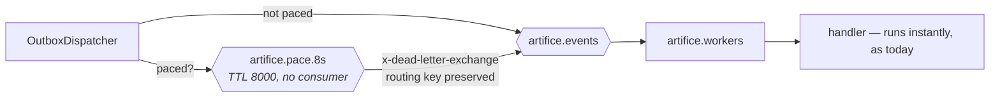

## Pacing: work that takes time, and the host that keeps the clock

**Labels:** simulation, backend, infra

## Summary

Give the factory a clock. Every stage currently completes in the same millisecond the message
arrives; this story makes a pick take seconds, a build take longer, and an inspection take a
moment — **without a handler ever sleeping** — by routing each stage's event through a ladder of
uniform-TTL delay queues before it is delivered. Also stands up `ArtificeWorks.Simulation`, the
third host, and the one scheduled-task loop the rest of the epic hangs its timers on.

## Why

Two reasons, and the second is the one that makes this story load-bearing.

The visible reason: an order that goes Intake → Completed in 40 milliseconds is not a factory, it
is a database transaction with a state machine on top. Epic 11's board has nothing to render —
orders blink through Scheduled, InProcess and Inspection faster than a browser repaints. Dwell
time in a status *is* the demo.

The structural reason: **the obvious way to add time is the one thing this system has already
ruled out.** 8.2 rejected in-process backoff for retries because prefetch is 1 — a sleeping
handler is not a slow order, it is a stopped factory, with every other order queued behind it and
a message held unacked the whole time. A `Task.Delay` in `ProductionService` would reintroduce
exactly that, and would do it on the happy path rather than the failure path. The answer is the
same answer 8.2 reached: **the delay belongs in the broker, not in the thread.**

## The shape of it

The rungs are uniform-TTL queues with no consumer, exactly like 8.2's retry ladder, and for
exactly the same reason: RabbitMQ releases a queue's messages **in order**, so per-message TTL on
a shared queue head-of-line blocks — a 34-second message at the head holds a 2-second message
behind it. One queue per duration removes the problem by construction.

Pacing is applied in **`OutboxDispatcher`**, which since 8.1 is the only place in the system that
puts a pipeline event on the wire. One publish site learns about pacing; no handler, no workflow
service and no event contract changes at all.

## The rung ladder

Fibonacci-ish, log-spaced, capped so a full five-stage order takes a minute or two rather than an
afternoon:

| rung | 1s | 2s | 3s | 5s | 8s | 13s | 21s | 34s |
|---|---|---|---|---|---|---|---|---|

A stage's configured duration and its jitter select a rung; **pacing is quantized, and jitter is
"which rung", not "how many milliseconds."** That is the trade the ladder buys, and it is
invisible at demo resolution.

Duration is chosen by **routing key**, because the wait represents the work the *consumer* is
about to do:

| event | the stage it pays for | default |
|---|---|---|
| `work-order.scheduled` | material picking | 5s |
| `work-order.materials-reserved` | production | 13s |
| `work-order.production-completed` | inspection | 5s |
| `work-order.rework-required` | rebuild | 8s |
| `work-order.inspection-passed` | carrier booking | 3s |
| `work-order.shipment-scheduled` | dispatch | 2s |

## Tasks

- [ ] New `src/ArtificeWorks.Simulation` host (`Host.CreateApplicationBuilder`, no web server).
      Same `AddArtificeWorksTelemetry(ArtificeWorksTelemetry.SimulationServiceName)` call the other
      two make, same DbContext and repository registrations, its own compose-ready configuration.
      It publishes and schedules; it consumes nothing
- [ ] **`PaceConfiguration`** mirroring `RetryConfiguration`: the rung array, `ExchangeFor`,
      `QueueFor`, `LabelFor`, and `RungFor(TimeSpan)` picking the nearest. Start the rung array
      **empty** with the shipped default behind it in a `Rungs` property — the 8.1 footgun where
      the configuration binder *appends* to a non-empty default array is a trap this file would
      walk straight into
- [ ] Declare the pace topology idempotently on connect: one durable fanout exchange and one
      queue per rung, `x-message-ttl` set, `x-dead-letter-exchange` = `artifice.events`, and
      **no `x-dead-letter-routing-key`** so the expiring message keeps the routing key that says
      what it is. Declared alongside the retry ladder, not in a second place
- [ ] `OutboxDispatcher` consults an `IPacePolicy` before publishing: a rung, or `null` for
      "straight to `artifice.events`". Off (the default) it returns `null` for everything and the
      dispatcher's behaviour is byte-for-byte what 8.1 shipped
- [ ] **Trace and correlation must survive the delay.** The producer span already restores the
      staged `traceparent` (9.1); a paced message adds seconds of wall clock between producer and
      consumer spans, which is *correct* and should render as a gap in the waterfall. Stamp
      `artificeworks.paced_ms` on the producer span so the gap is explained rather than suspicious
- [ ] Metrics: `artificeworks.messages.paced` counted by rung label (low cardinality, 9.2's rule
      holds), and the existing stage-transition counters left untouched
- [ ] **Cash 9.2's note**: an `IScheduledTask` abstraction plus one `PeriodicTaskHost` that runs
      every registered task on its own interval, replacing the standalone loops where it can.
      **Reconciling this with the separate-host decision** — see Notes; the fold is one *type*
      each host reuses, not one process that owns every timer
- [ ] Tests: a real-broker round trip (Testcontainers, the `WorkerConsumerTests` rig) asserts a
      paced event arrives at the handler after roughly its rung's TTL and **with its routing key
      and headers intact**; a second asserts two orders paced to different rungs are delivered in
      *rung* order, not publish order — the head-of-line property the ladder exists to provide;
      a third asserts pacing off leaves timing and topology unchanged

## Acceptance Criteria

- [ ] With pacing on, one order takes tens of seconds to reach Completed and visibly rests in
      each status on the way
- [ ] No handler, workflow service or event contract sleeps or changes shape
- [ ] A paced order and an unpaced order reach **identical** end state — asserted, not assumed
- [ ] The consumer keeps running other orders while one is paced; throughput does not collapse to
      one order at a time
- [ ] A paced message keeps its routing key, correlation id and trace context across the delay
- [ ] Pacing off is the shipped default and the existing suite passes untouched

## Decisions (to confirm at story start)

- **The delay lives in the broker.** Settled at grooming, and it is 8.2's argument reused: with
  prefetch 1 an in-process sleep is a pipeline stall, and it holds a message unacked for the
  duration, so a worker restart mid-pace loses the work back to a redelivery.
- **Quantized rungs, not the delayed-message-exchange plugin.** True per-message delay would mean
  a custom RabbitMQ image with a community `.ez` plugin — a build step to maintain and to
  self-host in M7 — to buy millisecond precision on a number nobody can perceive.
- **Applied in `OutboxDispatcher`, not at the publish sites.** 8.1 made one component the only
  thing that touches the wire specifically so that transport policy has one home. Pacing is
  transport policy.
- **Pacing applies to replayed dead letters too.** 8.3 replays through the outbox, so a replayed
  event is paced like any other. Correct rather than special-cased: the stage still takes as long
  as the stage takes.
- **A new host, not another hosted service in Workers.** Deliberate: the simulation must be
  stoppable without stopping the factory, and it must not be able to slow the consumers down.
  Costs a compose service, a health signal and a deployment unit in M7.

## Notes

Load-bearing. 10.2 tunes what this story establishes, 10.3 feeds it orders, and 10.4's sweep runs
on its scheduler.

**On folding the timers.** 9.2 flagged "fold them into one timer host before a fourth arrives",
and the grooming answer was to cash it — but `PipelineSnapshotService` cannot simply move into the
simulation host: `GET /system/stats` reads the snapshot in the API, and the worker's gauges read
it there. So the fold is an `IScheduledTask` + `PeriodicTaskHost` pair in Infrastructure that each
host composes with the tasks *it* needs, not a single process that owns every timer. That is what
the note was actually asking for; say so in the code, because "we folded the timers" and "there are
still timers in three processes" look contradictory otherwise.

`OutboxDispatcher` and `ParkedQueueDrain` stay as they are. They are consumers with their own
lifecycles, not periodic jobs, and forcing them through a scheduler would be the abstraction
earning its keep in the wrong place.
