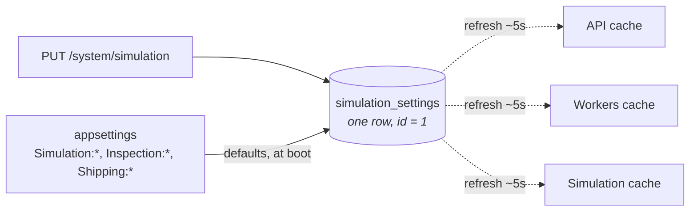

## Tuning: the factory's dials, turnable while it runs

**Labels:** simulation, backend, api

## Summary

Move the simulation's knobs — pacing, inspection failure rate, carrier refusal rate, generation
rate — out of startup configuration and into a single row that all three hosts read through a
cached snapshot, exposed as `GET`/`PUT /system/simulation`. Turn the failure rate up and watch the
rework loop start, on a running factory, without a restart.

## Why

The epic's acceptance criterion says pacing and failure rates are configurable *at runtime*, and
today they are emphatically not: `InspectionConfiguration`, `ShippingConfiguration` and
`ProductionConfiguration` are bound to POCO singletons at startup by
`WorkflowServiceCollectionExtensions`. Changing `Inspection:FailureRate` means editing a file and
restarting two processes — three, after 10.1.

That is a demo problem before it is an engineering one. The best moment in this system is *"watch
this"* followed by a visible change in behaviour. Restarting the factory to get it costs the
audience the thing they were watching, and in M7 it means shelling into a box.

There is also a two-process problem hiding here. A `PUT` handled by the API changes nothing about
what the worker does; the worker is where inspections actually fail. Whatever holds these values
has to be somewhere both hosts look — which is the same argument 9.2 made when it put the pipeline
gauges behind a shared snapshot, and it lands on the same answer.

## The shape of it

**appsettings supplies the defaults; the row supplies the overrides.** The row is created from
configuration on first run and thereafter is the authority. Nothing gets renamed — `Inspection:
FailureRate` and `Shipping:RefusalRate` keep their meaning and their documentation from 6.2 and
7.3, they just stop being the last word.

## Tasks

- [ ] `simulation_settings` — one row, singleton by construction (`CHECK (id = 1)`), holding the
      pacing durations per stage, the jitter percent, `FailureRate`, `RefusalRate`,
      `MaxRebuildAttempts`, the 10.3 generation knobs and the 10.4 world knobs. Migration
      `Simulation`
- [ ] `SimulationSettings` (Application) with a **cached snapshot** refreshed by an
      `IScheduledTask` on 10.1's `PeriodicTaskHost`, registered in all three hosts. Reads are a
      field read: **no request, no handler and no metric collection issues a query for a knob** —
      9.2's rule, restated
- [ ] Seed the row from configuration on first run, then leave it alone forever. A re-run must not
      quietly stomp a value someone set live — `CatalogSeeder`'s exact contract, for the same
      reason
- [ ] Point the existing consumers at it: `RandomVerdictSource`, `ConfiguredCarrierBooking`,
      `ProductionService`'s attempt cap and 10.1's `IPacePolicy` read the snapshot rather than
      their startup POCO. **The seeds stay in configuration** — a reproducible verdict sequence is
      a test affordance, not a dial, and a live-editable seed is a mistake waiting to be filed as
      a flake
- [ ] `GET /system/simulation` returns the current settings and their source (`configured` /
      `overridden`); `PUT` validates and replaces. Under `/system` deliberately: 8.3 put the
      dead-letter routes there so the eventual admin gate lands on **one path prefix**, and a
      stranger with a mouse being able to set the failure rate to 1.0 is precisely what that gate
      is for
- [ ] Validation with stable ProblemDetails codes, the 3.3 contract: rates outside 0.0–1.0, a
      pacing duration outside a sane band, a negative interval → `422`, code
      `simulation_setting_out_of_range`. Bounds are a shared-world courtesy, not paranoia
- [ ] Log every change at Information with the before and after — 9.3's levelling pass put holds
      and retries at Warning because they explain later surprises; "someone set the failure rate
      to 0.9 four minutes ago" is the same kind of fact
- [ ] Tests: a `PUT` changes worker behaviour within one refresh interval (integration, both
      hosts against one Postgres); an out-of-range value is rejected and the live value is
      unchanged; a fresh database seeds from configuration; a second boot does **not** overwrite
      an override

## Acceptance Criteria

- [ ] Failure rate, refusal rate and pacing can be changed while the factory runs, and the change
      is visible in the next order without a restart
- [ ] A change made through the API reaches the worker and the simulation host within one refresh
      interval
- [ ] Settings survive a restart of all three hosts
- [ ] Reading a setting never touches the database
- [ ] Out-of-range values are refused with a stable problem code and change nothing
- [ ] With no override ever written, behaviour is identical to what Epic 9 shipped

## Decisions (to confirm at story start)

- **A database row, not `IOptionsMonitor` over appsettings.** File-watch reload needs a writable
  mounted file on the M7 host, reaches one process, and gives Epic 11 nothing to call. The row
  reaches three processes and is a `PUT` away from a dashboard control.
- **Defaults stay in appsettings.** The row is an override layer, not a replacement. A fresh clone
  behaves exactly as documented in 6.2 and 7.3, and deleting the row is a working reset.
- **Seeds are not tunable.** `Inspection:Seed` and `Shipping:Seed` exist so a coin flip can be
  asserted. They stay in configuration.
- **The snapshot is cached and eventually consistent.** A `PUT` is not instant across hosts and
  should not pretend to be; the response says when it takes effect. Making it instant means either
  a query per decision or a broadcast, and both are worse than a five-second lag on a demo dial.
- **This is not failure injection.** These are global dials on the whole factory. Per-order
  targeting — *fail **this** inspection* — is Epic 12, needs a different guard and a different
  blast radius, and must not be smuggled in here.

## Notes

Depends on 10.1 for the scheduler and for the pacing values it tunes; 10.3 and 10.4 add their
knobs to the same row rather than inventing their own.

Watch the interaction with 10.1's ladder: changing a pacing duration re-selects a **rung**, so
small edits may not move anything and a message already sitting in a delay queue keeps its old
timing. Both are correct; both look like a bug if the endpoint doesn't say so. Return the rung the
duration resolved to, not just the duration.
