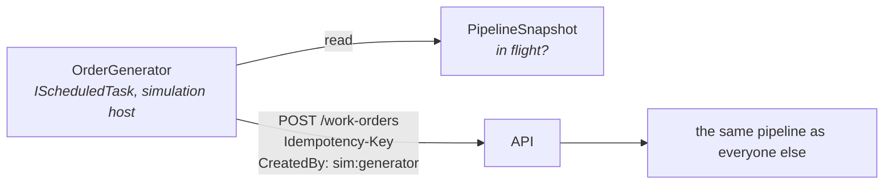

## A factory that is never idle, and knowing who did what

**Labels:** simulation, backend

## Summary

A generator in the simulation host that creates work orders at a low rate through the **public
API**, so a visitor arriving at 3am finds a factory mid-shift rather than an empty board. And a
persisted origin on every work order, so simulated work and visitor work are told apart in the
dashboard, the logs and the metrics.

## Why

The demo's worst moment is the first three seconds: a board with nothing on it, and a visitor who
has to create an order before anything at all happens. A factory with a dozen orders in flight
sells the system before the visitor has clicked anything.

The second half of the story is the guard rail that makes the first half safe to ship. Once
orders appear on their own, *"is that mine?"* becomes a question the UI has to answer, and
`GET /system/stats` counting simulated orders as throughput becomes a lie. It also matters for
10.4: the reset sweep needs to know what it may retire, and "everything the robot made" is a much
easier rule to defend than "everything old".

## The shape of it

**It goes over HTTP.** The epic's note is explicit: *the simulation rides the same events and
consumers as everything else — it is a client of the pipeline, not a parallel implementation. If
the simulation needs a shortcut the pipeline doesn't offer, that's a smell worth examining.* A
generator writing to `work_orders` directly would be that shortcut, and it would skip the
`[Idempotent]` filter, the DTO validation and the outbox row that all three exist to guarantee.
Going through the front door also means the generator is a working example for Epic 12's chaos
actions and a continuous, unattended smoke test of the create path.

## Tasks

- [ ] `OrderGenerator` as an `IScheduledTask` on 10.1's `PeriodicTaskHost`, using a typed
      `HttpClient` against the API's base address. `POST /work-orders` with a random seeded
      product, a plausible quantity, and an `Idempotency-Key` — the generator is exactly the kind
      of retrying client 8.4 was built for, so it should behave like one
- [ ] Knobs on 10.2's settings row: `Enabled` (**default false**), `IntervalSeconds`,
      `MaxInFlight`. Shipped off, so a fresh clone and the test suite stay deterministic — the
      same posture `Inspection:FailureRate` and `Shipping:RefusalRate` take. Development and the
      demo host turn it on
- [ ] `MaxInFlight` read from 9.2's cached `PipelineSnapshot`: below the ceiling it creates, at it
      it skips this tick. Self-limiting, so a paused worker or a broker outage doesn't leave a
      four-thousand-order backlog to greet whoever fixes it. **Skip quietly at Debug** — this is
      the normal state of a busy factory, not an event
- [ ] The API being unreachable is a **logged warning and a skipped tick**, never a crash and
      never a retry storm. Epic 9's rule generalises: the thing that watches or feeds the factory
      must not be able to take it down
- [ ] **`WorkOrder.Origin`** (`Visitor` / `Simulated`), set at construction and immutable. A real
      column, because Epic 11 will filter a board on it and a `LIKE 'sim:%'` over `CreatedBy` is
      not a query anyone should have to write. Migration folds into 10.2's `Simulation`
- [ ] Origin flows outward: on `WorkOrderDto`, as `artificeworks.origin` on the create span, in
      the correlation log scope, and as a **low-cardinality dimension** on the order-created and
      stage-transition counters. 9.2's rule is that a metric never gets a *per-order* label; a
      two-valued one is exactly the kind it does get, and without it `/system/stats` reports
      robot traffic as demand
- [ ] `CreatedBy` convention alongside it: `sim:generator`. The stage authors (`picking-worker`,
      `production-worker`, …) already distinguish machine work from human work in the timeline and
      need no change — **the gap was only ever at creation**
- [ ] `GET /system/stats` splits its counts by origin, so the dashboard can show real demand and
      simulated demand as separate lines rather than one indistinguishable total
- [ ] Tests: the generator respects `MaxInFlight` against a live snapshot; a generated order is
      `Origin = Simulated` end to end and a `POST` from a visitor is `Visitor`; an unreachable API
      leaves the host running; generation disabled creates nothing over several ticks

## Acceptance Criteria

- [ ] With generation on, orders appear at roughly the configured rate and the board is never empty
- [ ] The generator never exceeds `MaxInFlight` orders in flight
- [ ] Every work order carries a persisted origin, queryable and exposed on the DTO
- [ ] Simulated and visitor activity are separable in logs, traces, metrics and `/system/stats`
- [ ] Generation is off by default; the existing suite passes untouched
- [ ] Nothing the generator does can stop the API, the worker or the simulation host

## Decisions (to confirm at story start)

- **HTTP, not a direct write.** The epic's own smell test. It also keeps the generator honest
  about the API's contract, and gives Epic 12 a client to imitate.
- **A persisted `Origin` column, not a `CreatedBy` string convention.** Convention costs no
  migration and is unqueryable, unindexable and one typo from silently mis-classifying a visitor.
  Epic 11 filters on this.
- **Off by default.** Matches every other simulation-adjacent knob in the system, and the
  integration suite asserts on counts in places where orders appearing underneath it would be a
  cruel kind of flake.
- **Ceiling on in-flight orders, not a token bucket.** The failure this prevents is a backlog
  built during an outage, and a rate limiter does not prevent that — it just builds the backlog
  politely.
- **The generator never makes decisions.** It creates orders and nothing else: it does not advance
  them, does not inspect them, does not choose carriers and — settled at grooming — **does not
  release holds**. Every other stage already runs itself; anything held is a visitor's to rescue,
  which is what keeps 7.3's uncapped-refusal reasoning true.

## Notes

Depends on 10.1 for the host and the scheduler, and on 10.2 for the knobs. Independent of 10.4,
though 10.4's sweep is what stops generated orders accumulating forever and should be built
close behind.

The origin dimension is the piece with reach beyond this epic: Epic 11 filters on it, Epic 12
scopes chaos with it, and Epic 15's dashboards want simulated traffic excluded from anything that
looks like a business number.
