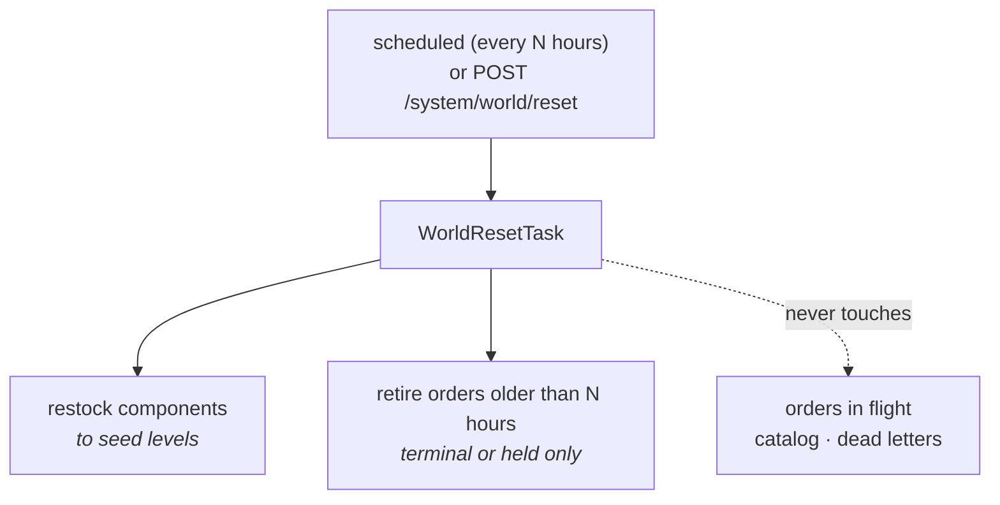

## The shared world: restocking, retiring, and putting the demo back

**Labels:** simulation, backend, api

## Summary

Keep a permanently-running shared factory habitable: restock component inventory to seed levels,
retire work orders that finished or stalled long ago, and offer both on a schedule and as
`POST /system/world/reset` — **without interrupting anything in flight**.

## Why

Everything before this epic assumed a factory that gets restarted. A demo on a home server does
not: it runs for months with strangers wandering through it, and two slow leaks eventually ruin it.

The first is inventory. `CatalogSeeder` deliberately *never* restocks — "so a re-run never
silently restocks a factory that has been consuming inventory" — which is exactly right for a
seeder and fatal for a shared world. Every order consumes components and nothing ever puts them
back; with 10.3's generator running, the shelves empty on their own. The failure is quiet and
bad: every new order holds at picking with a shortage, and the demo becomes a wall of held orders.

The second is accumulation. Thousands of Completed orders make the board useless, `/system/stats`
meaningless and the timeline query slow. And a visitor who wants to *show someone* the factory
needs a way to say "put it back how it started" that does not involve `docker compose down -v`.

## The shape of it

**The reset is a sweep, not a truncate.** It restores the two things that drift and refuses to
touch anything else. That is what makes "without downtime" fall out for free rather than being a
thing to engineer: nothing in flight is interrupted, because nothing in flight is in scope.

## What it may and may not touch

| touched | left alone |
|---|---|
| `components.on_hand` → seed level | the catalog: products, BOMs, components themselves |
| work orders in a **terminal** status (Completed, Cancelled) older than N hours | anything in Intake…Delivery — a live order is never reset out from under a visitor |
| work orders **OnHold or Faulted** older than N hours, and their reservations, units, runs, shipments | `dead_letters` — Epic 12 exists to show those off |
| | `outbox_messages` — the retention sweep already ages those out (8.1) |

Held and faulted orders are retired rather than repaired. Settled at grooming: **the simulation
never releases a hold**, so this is the only thing that eventually clears one, and it clears it by
removing it rather than by pretending to rescue it.

## Tasks

- [ ] Seed levels become data, not code: `components.seed_on_hand` written by `CatalogSeeder` at
      creation, so restock is `on_hand = seed_on_hand` and there is exactly one definition of
      "how much this factory starts with". Migration folds into 10.2's `Simulation`
- [ ] `WorldResetService` (Application) doing both halves in **one transaction**, with the
      retire cascade ordered so foreign keys are satisfied. A half-reset world is worse than an
      unreset one
- [ ] Restock is a **conditional set to seed level, never a blind increment** — repeated runs must
      be idempotent, and an increment that runs twice is a factory that mysteriously has more
      brass panels than it started with. It also must not lower stock below a live reservation's
      claim: 5.2's reservations are outstanding claims on the shelf, and the restock has to leave
      them satisfiable
- [ ] `WorldResetTask` as an `IScheduledTask` on 10.1's `PeriodicTaskHost` in the simulation host,
      interval and `RetireAfterHours` on 10.2's settings row. Default interval long (6h) and
      default retirement generous (24h) — the sweep should be almost invisible
- [ ] `POST /system/world/reset` runs the same code the schedule runs, returns what it did
      (components restocked, orders retired), and lives under `/system` behind the same eventual
      admin gate as 8.3's dead letters and 10.2's dials. A visitor must not be able to clear the
      board before a demo someone else is watching
- [ ] Log the sweep at **Information with its counts** — it is infrequent, it is destructive, and
      it is the first thing to suspect when an order someone was watching is gone. Its own span,
      so a slow sweep is visible in Tempo
- [ ] Metrics: `artificeworks.world.orders_retired` and `artificeworks.world.components_restocked`
      as counters, plus a `stock_level_ratio` gauge on the cached snapshot so the Grafana dashboard
      can show the shelves draining and refilling. That gauge is the most watchable thing in the
      story
- [ ] Tests: a sweep restores stock to seed levels and is idempotent across two runs; it retires
      terminal, held and faulted orders past the cutoff and **provably leaves an in-flight order
      untouched** — mid-pipeline, mid-pace; it never touches dead letters or the catalog; the
      cascade leaves no orphaned reservation, unit, run or shipment row; a reset running
      concurrently with a live order does not deadlock (the 5.2 component-ordering rule applies to
      the restock's `UPDATE`s too, and this is the second writer that ever touches components in
      bulk)

## Acceptance Criteria

- [ ] The world can be reset on a schedule and on demand, and both do exactly the same thing
- [ ] A reset never interrupts, alters or deletes an order in flight
- [ ] Component stock returns to seed levels and repeated resets are idempotent
- [ ] Old terminal, held and faulted orders are retired with no orphaned rows behind them
- [ ] The catalog and the dead-letter table are never touched
- [ ] A factory left running with generation on does not run out of stock or fill up with orders

## Decisions (to confirm at story start)

- **Restock + retire, not truncate + reseed.** A truncate can delete the order a visitor is
  watching, and it deletes the dead letters Epic 12 is built to display. This sweep can run at any
  moment without anyone noticing, which is the whole requirement.
- **Seed levels are data.** Restock needs a target, and re-deriving it from the seeder's static
  arrays at runtime couples a background sweep to a class whose job is first-run setup.
- **Held orders are retired, not rescued.** The grooming decision that the simulation leaves holds
  alone means something has to clear them eventually; time does, and a visitor's Release still
  beats the sweep to it.
- **Manual reset is a `/system` route.** Same reasoning as 8.3 and 10.2: the admin gate lands on
  one path prefix. Until it exists this is unauthenticated, like its neighbours, and that is
  recorded rather than forgotten.
- **The sweep does not reset the settings row.** "Reset the world" means the factory floor, not
  the dials someone deliberately turned. If that turns out to be surprising in practice, a
  `?includeSettings=true` is a one-line follow-up.

## Notes

Depends on 10.1's scheduler and 10.2's settings row; otherwise independent, and it is the story
that makes 10.3 safe to leave running unattended. Together they are the difference between a demo
that survives a month and one that has to be restarted before each viewing.

The restock is the second bulk writer against `components` — 5.2's picking is the first, and its
component-ordering rule exists to avoid deadlock. Order the sweep's updates by component id for
the same reason, and say why in the code, because it looks like a pointless `ORDER BY` otherwise.

M7 note: with this in place the demo host needs no cron job and no maintenance script. That is
worth stating in Epic 15's runbook when it gets written.
