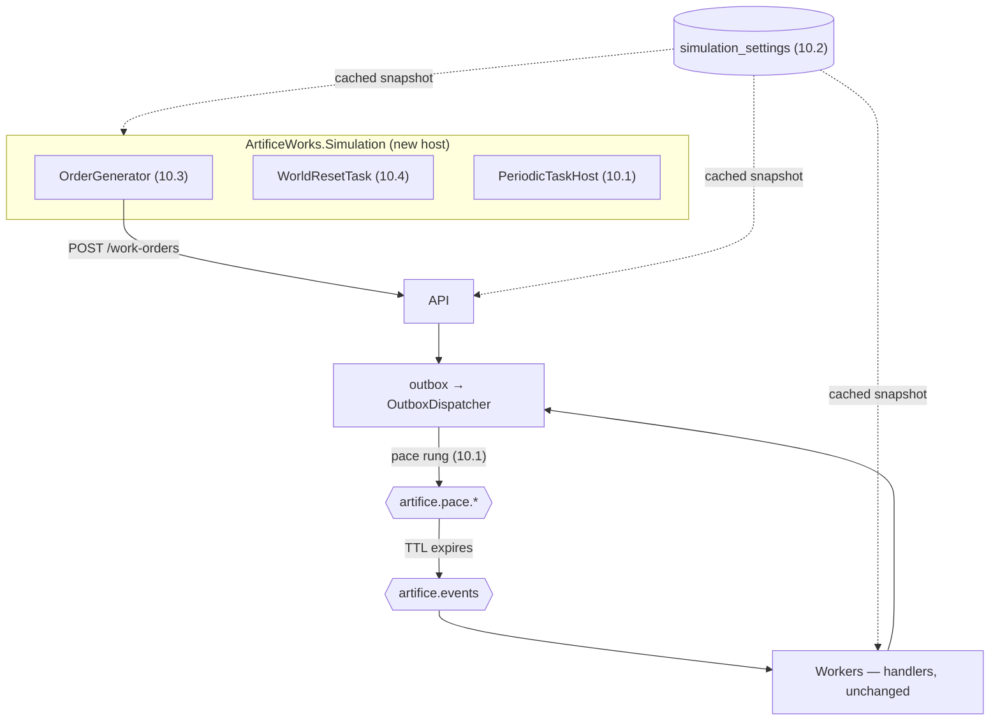

## [EPIC] Simulation engine

**Labels:** epic, simulation, backend
**Milestone:** M5

## Summary

Virtual operators and machines that make the factory run on its own: picks take time, production hums, inspections occasionally fail — without any human driving.

## Why

The demo model is hybrid: visitors create orders and make key decisions; simulated workers do the grunt work. The simulation is what makes the live demo feel alive rather than a form that submits to a database.

Epic 9 is what makes it trustworthy. A simulation that paces the factory is only believable if you
can watch it happen — and pacing is the first thing in this system that will make a trace show a
gap on purpose.

## Scope

- Simulated actors (pickers, assemblers, inspectors) that claim and complete pipeline work on realistic, slightly randomized timers
- Tunable behavior: pacing, failure rates, throughput — configurable without redeploy
- Natural failures: some inspections fail, some picks find shelves short, at low configured rates
- Shared-world lifecycle: seed script creates the catalog + initial inventory; a scheduled reset restores the world without downtime
- Background order generation (optional low rate) so the factory is never idle when a visitor arrives

## The shape of it

Three things worth reading off that diagram: the simulation host **publishes and schedules but
consumes nothing**; the pacing sits in the transport, not in a handler; and the settings row is
the only thing all three processes share besides the database itself.

## Acceptance Criteria

- [ ] A created work order progresses through the full pipeline with no human action
- [ ] Simulation pacing and failure rates are configurable at runtime
- [ ] The world can be reseeded/reset on a schedule and on demand
- [ ] Simulated activity is distinguishable in events/logs from visitor actions

## Stories

- [10.1 — Pacing: work that takes time, and the host that keeps the clock](10.1.md)
- [10.2 — Tuning: the factory's dials, turnable while it runs](10.2.md)
- [10.3 — A factory that is never idle, and knowing who did what](10.3.md)
- [10.4 — The shared world: restocking, retiring, and putting the demo back](10.4.md)

## Decisions taken at grooming

Interviewed and settled before the stories were written:

- **Pacing lives in the broker, on a quantized rung ladder.** A `Task.Delay` in a handler is not a
  slow order, it is a stopped factory — prefetch is 1, so everything else queues behind it, and
  the message is held unacked the whole time. That is 8.2's argument for the retry ladder, and the
  answer is the same shape: uniform-TTL delay queues that dead-letter back into `artifice.events`.
  Uniform per queue, because RabbitMQ releases messages **in order** and per-message TTL on a
  shared queue head-of-line blocks. The delayed-message-exchange plugin would give exact per-message
  delay, at the cost of a custom RabbitMQ image to build and self-host in M7, to buy precision
  nobody can perceive.
- **A separate `ArtificeWorks.Simulation` host.** The simulation must be stoppable without stopping
  the factory, and must not be able to slow the consumers down. It costs a compose service, a
  health signal and a deployment unit in M7 — accepted deliberately over folding two timers into
  the Workers host.
- **Knobs live in a `simulation_settings` row, read through a cached snapshot.** appsettings keeps
  supplying the defaults; the row overrides them, and all three hosts converge within one refresh.
  `IOptionsMonitor` over appsettings reaches one process, needs a writable mounted file in M7, and
  gives Epic 11 nothing to call.
- **Order generation ships off, goes over HTTP, and is capped by orders in flight.** Off by
  default, matching `Inspection:FailureRate` and `Shipping:RefusalRate`, so a fresh clone and the
  test suite stay deterministic. Over HTTP because the epic's own note says a shortcut the pipeline
  doesn't offer is a smell — and a direct write would skip 8.4's idempotency filter, the DTO
  validation and the outbox row.
- **"Reset the world" means restock + retire, not truncate + reseed.** A truncate can delete the
  order a visitor is watching and would destroy the dead letters Epic 12 exists to show off. A
  sweep that only restores stock and retires old, finished-or-stuck orders can run at any moment
  without anyone noticing — which is how "without downtime" stops being a thing to engineer.
- **The simulation never releases a hold**, which settles the question 7.3 left open (below).
- **9.2's "fold the timers" note is cashed here**, as an `IScheduledTask` + `PeriodicTaskHost`
  pair each host composes — not one process owning every timer, because `PipelineSnapshotService`
  has to keep running in the API for `/system/stats`.

## The one that isn't obvious: the actors already exist

The scope line says *"simulated actors (pickers, assemblers, inspectors) that claim and complete
pipeline work"*, and read literally that is a task table, a claiming protocol and a pool of virtual
workers — a second, parallel implementation of the thing Epics 5–7 already built.

It is already built. A pipeline stage **is** a worker: `artifice.workers` with prefetch 1 and a
manual ack is a picker holding one job and putting it down when it is done; `RandomVerdictSource`
is an inspector's judgement; `ConfiguredCarrierBooking` is a haulier's answer. What those actors
lack is not agency — it is **a clock and a temperament**. They work instantly, identically, and
only when a human starts them.

So this epic adds three things and no new pipeline: *time* (10.1), *tunable temperament* (10.2),
and *demand* (10.3), plus the housekeeping a permanently-running world needs (10.4). If a story
here starts wanting a claim table or a second path to a work order's state, that is the smell the
epic's own note warns about, and the answer is to route it through the existing stage instead.

## Notes

The simulation rides the same events and consumers as everything else — it is a *client* of the pipeline, not a parallel implementation. If the simulation needs a shortcut the pipeline doesn't offer, that's a smell worth examining.

**The standing question from 7.3, answered.** Carrier refusal is uncapped, and that was only ever
defensible because each release is a deliberate human act; a simulation that released holds on its
own would turn refusal into an infinite loop. It doesn't. Simulated actors create orders and run
stages; **holds are left for a visitor to rescue**, and 10.4's sweep retires whatever nobody
rescues. No cap is needed, and 7.3's reasoning stands unchanged. Revisit only if Epic 12 adds an
automatic recovery action.

Sequencing: 10.1 is load-bearing (the host, the scheduler, the pace ladder). 10.2 tunes what it
establishes; 10.3 feeds it orders and depends on both; 10.4 needs the scheduler and the settings
row but is otherwise independent — and is what makes 10.3 safe to leave running. Stopping after
10.1 already gives the demo the thing it most lacks: a factory you can watch work.

This epic hands Epic 11 three things it needs: dwell time long enough to render, a settings
endpoint to build controls on, and an origin flag to filter a board with.
