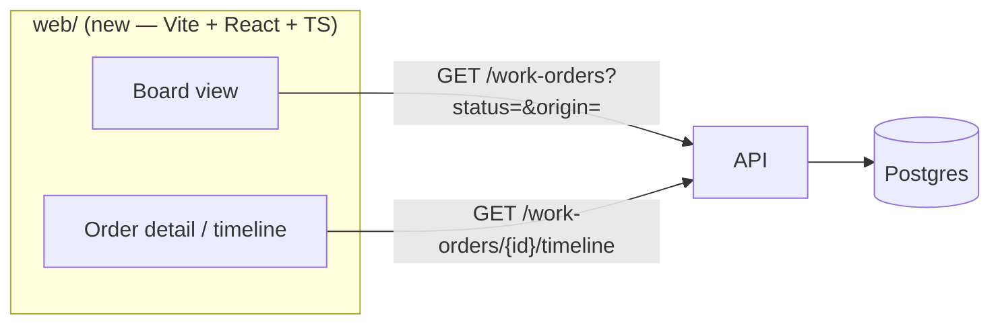

## The read-only app: the shell, the board, the timeline

**Labels:** frontend, api, demo

## Summary

Stand up the React/TypeScript app and give it its first two views against real data: a **board**
that shows every live order sorted into its pipeline stage, and an **order detail** that renders
the timeline endpoint already built in Epic 7. No realtime yet — the app fetches and polls. This
is the whole toolchain and one honest vertical slice, so 11.2 has something to make live rather
than something to invent.

## Why

Everything else in this epic hangs off two things existing: a frontend build that talks to the
API, and a way to list orders. The second one is missing outright — the API can fetch a work
order *by id* and nothing else. A board cannot be built on `GET /work-orders/{id}`; it needs a
read model that answers "what is in the factory right now, and which stage is each thing in."

Doing the scaffold and the board together — fetched, not live — gets a real picture on screen in
one story and keeps the realtime plumbing (11.2) from being entangled with "does the build even
work." The timeline view comes along because it is pure consumption of an endpoint that already
returns exactly the shape a detail page wants (`WorkOrderTimelineDto`, typed by `kind`), and
having it here means 11.2 makes *three* things live at once instead of retrofitting a third later.

## The shape of it

**Dev talks to the API through Vite's proxy, not across CORS.** The dev server proxies `/work-orders`,
`/system/*`, `/products` to the API's origin, so the browser makes same-origin requests and there
is no CORS policy to add, loosen, or forget to tighten.

**The load-bearing constraint this story must honour: the SPA calls the API with root-relative paths
only** — `/work-orders`, `/hubs/…` — never a hardcoded `https://api.…` host. Production is same-origin
by construction: Epic 15 puts the built bundle and the API behind one reverse proxy under a single
Cloudflare-tunnelled hostname (settled with the user; see EPIC_15's exposure topology), so the same
static bundle works in dev and in production untouched, and SignalR (11.2) is same-origin so its
websocket needs no cross-origin handling. *Where* it is finally served is Epic 15's job; this story
only owes a static bundle and relative paths.

## The board read model

A new list endpoint — the one read model the whole epic is missing:

- `GET /work-orders` returns a lightweight list DTO per order: `id`, `productName`, `status`,
  `origin`, `createdUtc`, `updatedUtc`. **Not** the full `WorkOrderDto` — a board renders a card,
  not a unit-by-unit breakdown, and the detail view already fetches the heavy shapes on click.
- Filterable by `status` and `origin` (both optional, repeatable), so the same endpoint backs the
  board, an "only visitor orders" toggle, and 11.3's "watch the one I just created."
- **Bounded by construction, newest first.** Default returns in-flight orders plus a capped window
  of recently-terminal ones — the board shows the same bounded world 10.4's sweep maintains, not
  an ever-growing wall of completed orders. A `limit` with a sane ceiling; no open-ended paging,
  for the same reason the timeline isn't paged.

## Tasks

- [ ] `web/` at the repo root: Vite + React + TypeScript, outside the .NET solution (it is not a
      `.csproj`). A dev proxy config pointing `/work-orders`, `/products`, `/system/*` at the API;
      `npm run build` emits a static bundle. A short `web/README.md` on run/build, and the right
      ignores so `node_modules`/`dist` don't land in git
- [ ] A typed API client layer: hand-written TS types mirroring the DTOs this epic consumes
      (`WorkOrderListItem`, `WorkOrderTimeline`, `TimelineEntry` with its `kind` union). One place
      that knows the wire shapes, so a contract drift is a compile error in one file
- [ ] **Backend: the board query.** `IWorkOrderRepository` (or a read-model repository) gains a
      list method; a `WorkOrderListItemDto`; `GET /work-orders` on `WorkOrderController` with the
      `status`/`origin`/`limit` filters and the bounded-window default. Projected in the database,
      not materialized-then-filtered in memory
- [ ] The board view: columns for the pipeline stages (Intake → Scheduled → InProcess →
      Inspection → Delivery → Completed) with OnHold / Fault / Cancelled surfaced distinctly, cards
      placed by `status`, `origin` visible on each card (a robot badge vs a visitor badge — the
      distinction 10.3 built the column for). Polls on an interval; a manual refresh
- [ ] The order detail view: fetches `/work-orders/{id}/timeline`, renders the entries as one
      chronological column switched on `kind` (state / pick / build / inspection / verdict /
      shipment) with per-kind detail. Reached by clicking a board card; a back route to the board
- [ ] Enough layout to be legible on a phone (the epic's own criterion — recruiters click links on
      phones): the board scrolls, columns don't force horizontal overflow of the page body
- [ ] A test for the new endpoint (the integration rig): filters narrow the set, the window is
      bounded and newest-first, an empty factory returns an empty list not a 404

## Acceptance Criteria

- [ ] `GET /work-orders` returns the factory's current orders, filterable by status and origin,
      bounded and newest-first
- [ ] The board shows every live order in its stage column, visitor and simulated orders
      distinguishable at a glance
- [ ] Clicking an order opens its timeline — every state change, pick, build, inspection, verdict,
      booking and dispatch in order
- [ ] The app builds to a static bundle and runs in dev against the API with no CORS configuration
- [ ] The board is legible on a phone

## Decisions (to confirm at story start)

- **A new list endpoint, not a Prometheus/stats query from the browser.** The board is order-level
  data (which order, which stage); `/system/stats` is aggregate counts. They answer different
  questions and 9.2 already argued against pushing a query language into the frontend.
- **A slim list DTO, not `WorkOrderDto`.** The full DTO carries units, shipment lines and history;
  a board card needs six fields. The detail view pays for the heavy read on click.
- **The board window is bounded, not paged.** 10.4's sweep keeps the live world bounded; the board
  mirrors that. Unbounded history is a report, not a live board, and no one is scrolling it.
- **`web/` lives outside the solution.** A JS app is not a .NET project; keeping it out of the
  `.sln` keeps `dotnet build`/`dotnet test` and CI unchanged until Epic 15 decides how it ships.

## Notes

First of the epic and deliberately the least clever: it exists so 11.2 has a live surface to attach
to and a board to update, rather than shipping the SignalR backbone and a board in one breath.

The timeline's own docstring already flags what it *isn't* — it is "what happened," derived from
the records, not a proof any message flowed. The detail view should present it that way; the
live **event feed** (11.2) is where message traffic itself appears.
