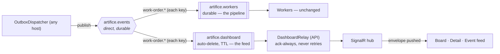

## Real-time: the SignalR hub, the API's bus relay, a factory that updates itself

**Labels:** frontend, api, backend, realtime

## Summary

Make the dashboard live. Add a **read-only bus subscriber in the API** on its own queue, relay
every `work-order.*` event to browsers over a **SignalR hub**, and turn the board, the order
detail and a new **live event feed** from polling into pushing. This is the story where the demo
stops being a form over a database and becomes a thing you *watch*.

## Why

The board polls today, and polling is the tell: a factory that only changes when you hit refresh
looks like a report, and the pacing 10.1 fought to add is invisible if the client samples slower
than the stages move. The demo's whole pitch — "watch this" followed by a visible change — needs
the change to arrive on its own.

There is a structural reason this belongs in the API and not the workers. The event feed must show
the **same** stream the pipeline runs on — one source of truth, not a parallel notification path a
handler remembers to call. That stream is the `artifice.events` exchange. So the API grows a
second, **non-competing** consumer: its own queue, bound to the work-order routing keys, that never
acks a message away from the worker because it is a different queue entirely. And it is exactly here
that `work-order.faulted` and `work-order.completed` finally get a subscriber — deliberately left
unconsumed since Epics 7–8 precisely so this feed would be their first reader.

## The shape of it

Two queues on one exchange is fan-out done honestly: the worker's queue drives the pipeline, the
dashboard's queue observes it, and neither can starve the other. Because `artifice.events` is a
**direct** exchange, there is no `work-order.*` wildcard — the dashboard queue binds **every**
published routing key explicitly, the full set including `created`, `faulted` and `completed`, which
is more than the six the worker handles and is the point.

## The relay's temperament

The dashboard subscriber is not a pipeline stage and must never behave like one:

- **It always acks.** A relay that failed to broadcast has lost a *screen update*, not a unit of
  work — there is nothing to retry and nothing to park. It never touches 8.2's ladder. A throw is
  logged and the message is acked; the outbox/worker path is the durable one, and the feed is
  allowed to miss a frame.
- **Its queue is auto-delete with a message TTL.** The feed is live traffic, not history. If the
  API is down the dashboard queue should not silently hoard messages to replay a flood on
  reconnect, and it should vanish when the last API instance goes. This is the opposite of the
  worker queue's durability on purpose.
- **It reads, it does not write.** No DbContext, no outbox, no state change. It deserializes just
  enough of the envelope to relay it (10.x's `EventEnvelope` metadata is already "self-describing …
  what the Epic 11 dashboard feed renders" — its own docstring said so).

## Tasks

- [ ] **API: the dashboard queue + relay.** A hosted consumer on `artifice.dashboard` (auto-delete,
      `x-message-ttl`), bound to every `work-order.*` routing key — enumerate the published set in
      one place so a new event type is one line, not a hunt. Ack-always, no retry/park path. Runs in
      the API host alongside the existing `OutboxDispatcher`
- [ ] **The SignalR hub** in the API: one hub, one broadcast method carrying the envelope metadata
      (`eventId`, `eventType`, `correlationId`, `occurredUtc`) plus the `workOrderId` the payload
      names, so the board can update a single card and the feed can render a line without a second
      fetch. Map the hub route; add it to the dev proxy (SignalR negotiates then upgrades — the
      proxy must pass the websocket through)
- [ ] Frontend SignalR client: connect on load, auto-reconnect, surface connection state (a live
      demo that silently went dead is worse than one that says "reconnecting")
- [ ] Board goes live: an incoming event moves/updates the matching card in place; falls back to the
      11.1 poll only as a reconnect reconciliation, not the primary path
- [ ] Order detail goes live: while open, an event for that order re-fetches (or appends to) its
      timeline, so a watched order animates through its stages
- [ ] **The live event feed** panel: envelopes stream newest-first as they happen — event type,
      order, correlation id, time — capped to a rolling window (the feed is a tail, not a log; the
      dead-letter view and traces are where history lives). Visitor vs simulated distinguishable
- [ ] Tests: an integration test that a published `work-order.*` event reaches a connected SignalR
      client via the real relay (the Testcontainers broker rig); an assertion the dashboard queue's
      consumption does **not** remove the message from the worker's queue (both fire); an assertion
      a relay broadcast failure still acks and does not requeue

## Acceptance Criteria

- [ ] The board updates without a refresh as orders move through the pipeline
- [ ] The event feed shows real broker traffic — every published `work-order.*` event, including
      `faulted` and `completed` — as it happens
- [ ] An open order detail animates through its stages live
- [ ] The dashboard subscriber never steals a message from the worker and never retries or parks
- [ ] The client shows its connection state and recovers from a dropped connection
- [ ] With the dashboard down, the pipeline is unaffected and no queue grows without bound

## Decisions (to confirm at story start)

- **A second queue on the same exchange, not a second exchange and not a worker-side callback.** The
  feed must be the same stream the pipeline runs on. Fan-out via a bound queue is that; a handler
  calling SignalR is a parallel path that drifts, and 4.x's "the routing key is the event type"
  makes the binding trivial.
- **The relay lives in the API, not the workers.** The hub lives where the browser connects, and the
  API already runs an `OutboxDispatcher`, so it already owns a broker connection. Putting the hub in
  the workers would need a SignalR backplane to reach the API's clients — cost with no benefit at
  demo scale.
- **Ack-always, auto-delete, TTL'd.** The relay is observation. Durability and retries are for work
  that must happen once; a dropped frame is not that, and a hoarding queue is a reconnect flood
  waiting to happen.
- **Explicit per-key bindings, because the exchange is direct.** No `work-order.*` wildcard exists on
  a direct exchange. Enumerating the keys is also the honest inventory of "what the factory
  announces," and the moment `faulted`/`completed` stop being orphans.

## Notes

Depends on 11.1 for the app, the board and the detail view to make live. Hands 11.4 the exact
stream its architecture diagram animates on — the diagram is presentation over *this* feed, not a
new backend.

Watch the ordering caveat from architecture.md: publishing is per-host and at-least-once, so the
feed can occasionally show a duplicate or two events a hair out of order. That is honest — it is
what the bus actually did — and the feed should tolerate a repeated `eventId` rather than assume
exactly-once, the same way the pipeline's dedupe keys do.
