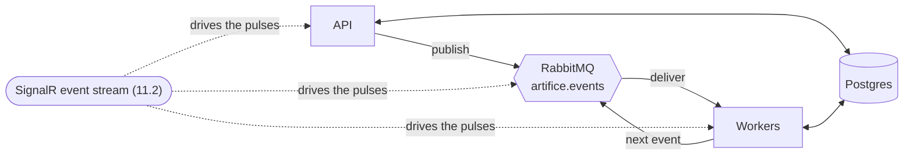

## The showpiece: the animated architecture diagram

**Labels:** frontend, demo

## Summary

The picture the whole portfolio piece is for: API, broker, workers and database drawn as a living
system, with components and the paths between them **pulsing as real messages flow through them**.
It is presentation layered on 11.2's event stream — every pulse is a genuine event the factory just
published, not a decorative animation on a timer.

## Why

This is the line on the résumé made visible. "Event-driven architecture and domain-driven design —
reliability engineering made visible" is the pitch, and a diagram where you can *see* an order's
event leave the API, sit in the broker, arrive at a worker, and come back is that pitch in one
glance — for a viewer who will never read the code. It is deliberately last because it is the
showpiece and it depends on everything under it being stable: a diagram animating off a flaky
stream advertises flakiness.

## The shape of it

The diagram is a fixed drawing of the topology in architecture.md; what moves is **which node and
edge lights up when**, driven entirely by the SignalR envelopes already arriving. An event's type
says which hop it is (a `work-order.scheduled` pulses API→broker→worker; a `work-order.rework-required`
pulses the loop back to production), so the animation is a pure function of the stream.

## What lights up, and from what

- **Nodes pulse** when they act: the API on a publish, the broker as the event's waypoint, the
  worker on delivery. The envelope's `eventType` maps to a hop; that mapping is the one new piece of
  domain knowledge and it lives in the frontend.
- **Edges flow** in the direction the event travelled. A paced event (10.1) genuinely dwells in the
  broker before reaching the worker — the diagram showing that pause is *correct*, and it visualizes
  the one thing pacing exists to make watchable.
- **Health/throughput** colours the nodes from `GET /system/stats` (9.2) on a slow poll: a backed-up
  outbox or a Degraded broker tints the node, so the diagram shows not just traffic but *strain*.
  Low-frequency poll, not per-event — stats are aggregate and the snapshot is cached anyway.
- **The failure paths, if cheap:** a `work-order.faulted` or a parked message (the dead-letter count
  from `/system/stats`) pulses a distinct "trouble" state. This is the seam Epic 12 will drive hard
  (inject a failure, watch it dead-letter and recover); leaving the diagram able to *show* a fault
  here is what makes 12 mostly a matter of giving the visitor the button.

## Tasks

- [ ] The static topology drawing — API, broker, workers, DB — matching architecture.md so the
      picture and the docs agree. Inline SVG or a small canvas; no heavy diagram dependency for four
      nodes and a handful of edges
- [ ] The event→hop mapping: each `work-order.*` type resolves to the node/edge sequence it
      exercises, including the rework loop's back-edge. One table, the diagram's only domain
      knowledge
- [ ] Drive pulses off the live SignalR stream from 11.2 — no new backend for the animation itself.
      A pulse is scheduled when its envelope arrives; concurrent orders light overlapping hops
      without the animation queueing up or dropping frames
- [ ] Node health tint from a slow `GET /system/stats` poll: throughput, in-flight, outbox backlog,
      dead-letter count. Degraded/backlogged nodes read as strained
- [ ] A distinct visual for a fault / parked message, so the trouble path is legible before Epic 12
      makes it interactive
- [ ] Performance: the animation must stay smooth while the feed is busy (sim generation on) and
      must not leak timers/handlers on unmount or reconnect. It is the thing left running on a big
      screen at a demo
- [ ] Phone-legible: the diagram scales down to a glanceable version rather than overflowing

## Acceptance Criteria

- [ ] The architecture diagram animates with live activity — every pulse corresponds to a real
      published event
- [ ] A paced order visibly dwells in the broker before reaching the worker
- [ ] Node colour reflects factory health from `/system/stats` (a backlog or a Degraded component is
      visible)
- [ ] A fault / parked message is visually distinct from a healthy flow
- [ ] The animation stays smooth under a busy feed and cleans up on unmount/reconnect
- [ ] It is legible on a phone

## Decisions (to confirm at story start)

- **The animation is driven by the real event stream, never a decorative timer.** A fake pulse would
  quietly turn the portfolio's honesty claim into a lie; every pulse must be an event that happened.
- **No new backend.** 11.2's SignalR stream and 9.2's `/system/stats` already carry everything —
  traffic from the stream, strain from the stats. Inventing a diagram-specific feed would be a second
  source of truth to drift.
- **Hand-drawn SVG/canvas over a diagram library.** Four nodes and a rework loop do not justify a
  dependency, and the animation control needs to be ours anyway.
- **Fault visualization now, fault *injection* in Epic 12.** Showing trouble is presentation over
  data that already exists; injecting it needs a guarded endpoint and a blast radius, and belongs to
  the epic built for it.

## Notes

Last by design — the showpiece that assumes the board, the feed and the interactions beneath it are
solid. Depends most on 11.2 (its stream) and reads 9.2's `/system/stats`.

Hands Epic 12 a diagram that can already *show* a fault and a dead letter; that epic's job becomes
giving the visitor the lever (fail an inspection, kill a pick, poison a message) and letting this
picture do the rest — retries climbing the ladder, a message parking, a replay recovering — which is
the reliability-made-visible story the whole project is named for.
