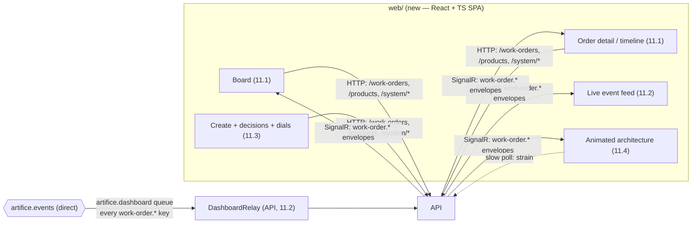

## [EPIC] Demo dashboard

**Labels:** epic, frontend, demo
**Milestone:** M5

## Summary

A purpose-built React/TypeScript dashboard: create and follow work orders, watch a live event feed, and see an animated architecture diagram where components light up as messages flow.

## Why

This is the face of the portfolio piece. It's how a visitor — or a hiring manager — experiences the event-driven machinery without reading code.

## Scope

- React + TypeScript SPA, real-time updates via SignalR
- Work order board: orders by pipeline stage, live-updating as events fire
- Order detail / timeline view: every state change, event, pick, build, inspection, and retry for one order (a distributed trace made friendly)
- Live event feed: published/consumed messages streaming as they happen
- Animated architecture diagram: API, broker, workers, DB as a living picture — components pulse as traffic passes through them
- Visitor affordances: create an order from a template, make the hybrid-model decisions (approve schedule, choose spec)

## The shape of it

The one new backend surface is small and deliberate: a **board read model** (`GET /work-orders`,
11.1 — the API today can only fetch an order by id) and a **read-only bus relay + SignalR hub**
in the API (11.2). Everything else is a client of endpoints Epics 5–10 already shipped to be
called from here.

## Acceptance Criteria

- [ ] Dashboard shows the factory state in real time without refresh
- [ ] A visitor can create a work order and watch it travel the whole pipeline
- [ ] The event feed shows real broker traffic as it happens
- [ ] The architecture diagram animates with live activity
- [ ] Works acceptably on a phone (recruiters click links on phones)

## Stories

- [11.1 — The read-only app: the shell, the board, the timeline](11.1.md)
- [11.2 — Real-time: the SignalR hub, the API's bus relay, a factory that updates itself](11.2.md)
- [11.3 — Visitor affordances: create an order, make the decisions, turn the dials](11.3.md)
- [11.4 — The showpiece: the animated architecture diagram](11.4.md)

## Decisions taken at grooming

Settled before the stories were written:

- **The feed is a second, non-competing consumer on the same exchange — in the API.** The hub lives
  where browsers connect and the API already owns a broker connection (its `OutboxDispatcher`). A
  dedicated `artifice.dashboard` queue observes `artifice.events` without ever stealing a message
  from `artifice.workers`. A handler calling SignalR would be a parallel notification path that
  drifts from the real stream; a hub in the workers would need a backplane to reach the API's
  clients. This is the epic note's "one source of truth" made concrete.
- **The relay is observation, not work: ack-always, auto-delete, TTL'd.** A missed broadcast is a
  dropped screen frame, not a lost unit — it never touches 8.2's retry ladder, and its queue is
  auto-delete with a message TTL so a downed dashboard neither hoards a reconnect flood nor
  outlives the process. The opposite of the worker queue's durability, on purpose.
- **`artifice.events` is `direct`, so the feed binds every `work-order.*` key explicitly** — there
  is no wildcard. That enumeration is also the honest inventory of what the factory announces, and
  it is where `work-order.faulted` and `work-order.completed` finally get their first subscriber,
  left deliberately orphaned since Epics 7–8 for exactly this.
- **A new board read model, because none exists.** The API can fetch an order by id and nothing
  else; a board needs a list. `GET /work-orders` returns a slim list DTO filtered by status/origin,
  bounded and newest-first — mirroring 10.4's bounded live world rather than an ever-growing wall.
  Not a Prometheus query from the browser (9.2's argument), not the heavy `WorkOrderDto`.
- **The UI drives the ordinary endpoints; there is no dashboard back door.** A visitor action *is* a
  pipeline action — 6.2's verdict and 7.x's booking endpoints were built same-path for this. A
  shortcut the pipeline doesn't offer is the smell the project keeps warning about. If a decision
  moment seems to need a new endpoint, that is a finding about the endpoint's reusability.
- **The dials are 10.2's global tuning, not failure injection.** `PUT /system/simulation` retunes
  the whole factory; per-order "fail *this* one" is Epic 12 with a different blast radius and must
  not be smuggled in.
- **`web/` is a Vite + React + TypeScript app at the repo root, outside the `.sln`.** A JS app is
  not a .NET project; keeping it out leaves `dotnet build`/`test` and CI untouched. Dev talks to the
  API through Vite's proxy (same-origin, no CORS to add or forget to tighten); production is a static
  bundle whose hosting is an Epic 15 decision. Realtime is **SignalR** — the DTO docstrings have
  named it the transport since Epic 4.
- **The animated diagram is presentation over the live stream, never a decorative timer.** Every
  pulse is a real published event; strain colour comes from `/system/stats`. A fake pulse would
  quietly falsify the portfolio's honesty claim.

## Notes

SignalR hub lives in the API and relays the same event stream the workers consume — one source of truth. Build the board and timeline first; the animated diagram is the showpiece but depends on everything else being stable.

**Sequencing.** 11.1 is the foundation — the toolchain plus the one missing read model — and is
the only story with meaningful backend beyond the relay. 11.2 is the heart: the SignalR backbone
that makes the board, the detail and a new feed live, and it is load-bearing for 11.4. 11.3
(interaction) and 11.4 (the showpiece) both sit on 11.2 and are largely independent of each other,
so their order is a preference — 11.3 makes the demo *usable*, 11.4 makes it *impressive*. Stopping
after 11.2 already gives the headline: a factory that shows itself working, live, with no one
driving.

**Least cross-cutting epic in a while — one story per conversation.** Each story is a coherent,
demoable unit with its own check-in, and only 11.1–11.2 touch the backend at all. This hands
**Epic 12** a diagram that can already show a fault and a dead letter, so failure *injection*
becomes mostly a matter of giving the visitor the lever.

## Implementation plan

- **Recommended batching:** one story per implementation run. This is a new codebase (a JS
  frontend) with a different toolchain, and each story reaches a natural demoable stop — a board,
  then a live board, then interaction, then the showpiece. 11.1 and 11.2 are the two with backend
  work and are the ones worth reviewing most closely.
- **Where a subagent helps:** none of these need an upfront "find every X" sweep — the backend
  surface is small and already mapped in this grooming (the board endpoint is *new*, not found;
  the relay's integration point is `artifice.events` + the API host). If 11.2 wants to confirm how
  the existing Testcontainers broker rig is set up (`WorkerConsumerTests`), that single lookup is
  worth an `Explore` to keep the SignalR-integration-test cost out of the implementing context.
- **Working set per story** (load these, don't re-explore):
  - *11.1:* `WorkOrderController.cs`, `IWorkOrderRepository.cs` + its EF implementation,
    `WorkOrderDto.cs` / `WorkOrderTimelineDto.cs`, the API `Program.cs`. New: `web/`.
  - *11.2:* `RabbitMqConsumerService.cs` (the relay's model), `IRabbitMqConnection` / the raw
    publisher, `EventEnvelope.cs`, `docs/messaging-topology.md`, the API `Program.cs`.
  - *11.3:* `ProductController.cs`, `SimulationController.cs`, `WorkOrderController.cs`, the
    ProblemDetails codes (`ProblemCodes`), plus the `web/` client from 11.1.
  - *11.4:* `docs/architecture.md` (the topology to draw), `SystemStatsController.cs` /
    `SystemStatsDto.cs`, and 11.2's SignalR client.
