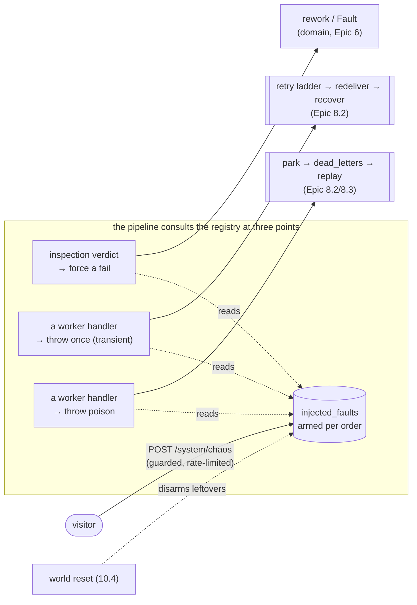

## [EPIC] Failure injection

**Labels:** epic, demo, reliability
**Milestone:** M6

## Summary

Visitor-triggered chaos: fail this inspection, kill a worker mid-pick, poison a message — then watch the reliability machinery from Epic 8 recover, live on the dashboard.

## Why

This is the money shot for an event-driven portfolio. Anyone can claim "handles failures gracefully"; this demo *shows* it, on demand, to a stranger with a mouse.

## Scope

- Failure injection API (guarded, rate-limited): per-order failure flags and system-level chaos actions
- Fail an inspection: the targeted order's inspection fails, visibly routing to the fault/rework path
- Kill a worker mid-task: a consumer dies while holding work; the message redelivers and another consumer completes it
- Poison message: an unprocessable message retries, then dead-letters — visible in the feed and DLQ view
- Dashboard integration: chaos buttons in context, plus a DLQ inspector showing dead-lettered work and offering reprocess

## The shape of it

Failure injection is **one small new write surface and three consult points**. The registry is the
only new state; every recovery path already exists (Epic 8's retry ladder, parked queue and
`dead_letters`; the domain rework loop). Chaos is *data the pipeline reads*, not a code path that
bypasses it.

Read left to right it is the epic's whole claim: a visitor arms a fault on **one order they are
watching**, the pipeline hits it exactly once, and the recovery that follows is the *real*
machinery — not a scripted animation. The registry is bounded (one order, armed briefly, swept by
the world reset), which is the "bounded blast radius" acceptance criterion made concrete.

## Acceptance Criteria

- [ ] Each injected failure produces a visibly correct recovery on the dashboard
- [ ] Injected chaos cannot corrupt the shared world (bounded blast radius, world reset covers the rest)
- [ ] Dead-lettered work is visible and reprocessable from the dashboard
- [ ] Failure injection is rate-limited so visitors can't grief each other

## Stories

- [12.1 — The injection registry, and the first lever: fail an inspection](12.1.md)
- [12.2 — Kill a worker, poison a message: injecting into the pipeline itself](12.2.md)
- [12.3 — The money shot: chaos in context and the dead-letter inspector](12.3.md)

## Decisions taken at grooming

Settled before the stories were written:

- **A fault is data the pipeline consults, not a back door that bypasses it.** 11.3 held the line
  that "a visitor action *is* a pipeline action, there is no dashboard shortcut." Chaos is the one
  thing that genuinely *is* new — you cannot fail an order without a new lever — so the honest split
  is: the **injection** is a new `/system` write (like the dials), but the **recovery** runs
  entirely on Epic 8's existing paths. The pipeline reads an armed fault the way the inspector reads
  the failure rate; it never gets a special "chaos mode" code branch. If a recovery seems to need
  new machinery, that is a finding about Epic 8, not a licence to add a parallel path.
- **The blast radius is one order, targeted by id.** Every fault names a `WorkOrderId` and fires
  against that order only — the shared-world courtesy the epic note asks for. This is the *opposite*
  blast radius from 10.2's dials (the whole factory) and is exactly the line architecture.md drew
  between global tuning and per-order injection. It also means the injection surface lives under
  `/system` with the dials, the dead letters, the stats and the world reset — the admin gate
  deferred since Epic 3 keeps falling on one path prefix.
- **Faults live in a DB registry, not in memory.** The API arms a fault; the *worker* (a different
  process) hits it. That crosses a process boundary, so it must be shared state — an `injected_faults`
  table, consulted by the worker and swept by 10.4's world reset. This mirrors the settings row and
  `dead_letters`: durable, queryable, and something the dashboard can show ("this order is armed to
  fail"). An in-memory dictionary in one host would be invisible to the other and lost on restart.
- **A fault fires once, and the disarm commits even when the stage's work rolls back.** The transient
  fault's whole demo is *break, then recover*: attempt 1 throws, the message climbs the retry ladder,
  attempt 2 finds the fault disarmed and completes. That only works if disarming survives the
  transaction the throw rolled back — so the registry write that consumes a fault is a **separate,
  committed** operation, deliberately outside the stage transaction. Get this wrong and the fault
  re-fires every redelivery and the order parks instead of recovering. This is the one genuinely
  subtle correctness point in the epic, and it lives in 12.2.
- **Three levers, mapped 1:1 to the scope, each landing on a different recovery.** *Fail an
  inspection* → the domain rework/Fault loop (Epic 6), no broker involvement. *Kill a worker mid-task*
  → a one-shot transient throw → the retry ladder redelivers and the next attempt completes (Epic
  8.2). *Poison a message* → an immediate park → `dead_letters` → the visitor replays it (Epic
  8.2/8.3). Each lever exercises a *different* half of the reliability story, which is why all three
  earn their place rather than being three flavours of the same thing.
- **"Kill a worker" is an injected transient, honestly labelled — not a real process kill.** The
  faithful literal act (SIGKILL a shared worker) would break the demo for everyone else watching, so
  the stand-in is a handler that throws before it acks: the message is redelivered and another
  delivery completes it, which is precisely what a mid-task death looks like from the broker's side.
  The portfolio's honesty principle says to *say* it is a simulated death in the copy, not to imply a
  process was killed.
- **Rate limiting is the guardrail that makes an anonymous chaos button safe.** The injection
  endpoint(s) get ASP.NET's rate limiter — this is the project's first — so a visitor (or a script)
  can't arm faults faster than a human demo needs. Paired with the one-order blast radius and the
  world-reset sweep, that is the "can't grief each other" and "can't corrupt the shared world"
  criteria covered without an auth gate that still doesn't exist.

## Notes

Scope chaos to the order the visitor is viewing wherever possible — shared-world courtesy. This epic
is mostly *wiring existing reliability into the demo*; if Epic 8 was built well, this epic is small
and delightful. Epic 11.4 already left the architecture diagram able to *show* a fault and a parked
message (strain colour off `/system/stats`, a `faulted` pulse off the stream), so 12 is largely a
matter of giving the visitor the lever and making the dead letters clickable.

**Sequencing.** 12.1 is the backbone — the registry, the guarded endpoint, the rate limiter, the
world-reset sweep — and proves itself on the gentlest fault (fail an inspection routes through the
existing rework loop with no broker subtlety). 12.2 reuses that backbone for the two broker-facing
faults and carries the epic's one hard correctness point (disarm-outside-the-rolled-back-transaction).
12.3 is frontend: the contextual chaos affordance and the dead-letter inspector, the first browser
surface for `dead_letters`. Stopping after 12.2 already gives the headline over the API and the
integration tests — a fault injected, retried, recovered, or parked and replayed; 12.3 makes it
clickable by a stranger.

**This closes M6's failure story** and hands Epic 13 (deep domain) a system whose reliability is not
just built but *demonstrable on demand*.

## Implementation plan

- **Recommended batching:** **12.1 on its own first**, then 12.2, then 12.3. 12.1 is the
  design-load-bearing story — the registry shape, the endpoint contract, the rate-limiter placement
  and the world-reset hook are decisions the other two build on, and they are worth reviewing before
  more is stacked on them. 12.2 and 12.3 are each a clean, demoable unit with a natural check-in. If
  the user wants momentum over review granularity, **12.1 + 12.2 combine into one backend run** (they
  share the registry and both end in integration tests) with 12.3 as its own frontend run — but the
  default is one story per run, because 12.2's disarm-vs-rollback subtlety deserves its own focused
  pass.
- **Where a subagent helps:**
  - *12.2:* one `Explore` sweep — "for each pipeline stage, which service method does the handler
    call, and where is the natural single choke point to consult a fault before the stage's work
    commits?" — keeps that mapping cost out of the implementing context. Also worth the same
    single lookup 11.2 flagged: how the Testcontainers worker rig is stood up
    (`WorkerConsumerTests` / `DashboardRelayTests`) so the retry-and-recover integration test starts
    from a known harness.
  - *12.1 and 12.3:* none needed — the surfaces are already mapped in this grooming (the registry is
    *new*; the endpoint neighbours are the `/system/*` controllers; the DLQ endpoints already exist).
- **Working set per story** (load these, don't re-explore):
  - *12.1:* `SimulationController.cs` and `WorldController.cs` (the `/system` neighbours to match),
    `SimulationSettingsService.cs` + `SimulationSettingsRow.cs` (the settings-row pattern to mirror
    for the registry), `WorldResetService` (add the sweep), `ProblemCodes.cs`, `RandomVerdictSource.cs`
    / `InspectionConfiguration.cs` (the first consult point), the API `Program.cs` (rate limiter).
  - *12.2:* the worker handlers (`WorkOrderScheduledHandler.cs`, `MaterialsReservedHandler.cs`, and
    the service each calls — `MaterialPickingService`, `ProductionService`), `RabbitMqConsumerService.cs`
    and `PoisonMessageException.cs` (the failure taxonomy the throws must land in), the 12.1 registry,
    `docs/messaging-topology.md` (record the injection consult points).
  - *12.3:* `web/src/components/OrderActions.tsx` (where the contextual chaos panel joins the decision
    moments), `web/src/api/client.ts` + `types.ts`, `web/src/views/OrderDetailView.tsx`,
    `web/src/AppLayout.tsx` (a new dead-letters route), `web/src/components/EventFeed.tsx` +
    `web/src/domain/events.ts` (labelling a park/replay), and `DeadLetterController.cs` /
    `DeadLetterPageDto` for the inspector's shape.
