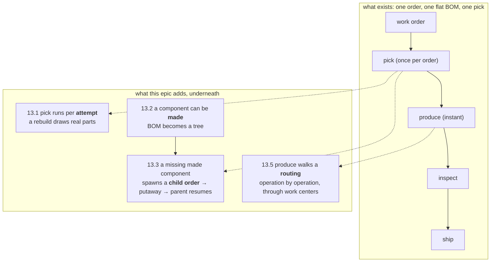

## [EPIC] Deep domain: multi-level BOMs and routings

**Labels:** epic, domain, backend
**Milestone:** M6

## Summary

Deepen the manufacturing model: sub-assemblies with their own BOMs spawning child work orders, and routing steps through work centers.

## Why

This is the DDD showpiece — the shared-platform story from the company pitch made real in the model. It's sequenced late deliberately: the pipeline must already work end-to-end (pipeline-first principle) so this epic deepens rather than destabilizes.

## Scope

- Multi-level BOMs: a component can itself be a manufactured assembly (wheel = rim + spokes + hub); picking a missing sub-assembly spawns a child work order
- Parent/child work order relationships, with parent progress gated on children
- Routings: ordered operation steps (e.g., chassis fab → core install → limb fitting → sensor calibration → final inspection) through named work centers
- Work center capacity as a simple constraint the scheduler and simulation respect
- Shared-platform payoff: BOM explosion view showing component overlap across Custodian / Delver / Courier
- **Plus the deferral this epic was named as the home for**: attempt-scoped material reservations, so a rebuild consumes real components (architecture.md, *Known simplifications*)

## The shape of it

Every earlier epic added a **stage**. This one adds **depth underneath the stages that already exist** — and the whole design problem is keeping it there, so the pipeline the last nine epics hardened does not have to change shape to accommodate it.

Read top to bottom, the claim is that **nothing in the top row moves**. A child work order is an ordinary
work order that happens to have a parent, running the ordinary pipeline. A routing is a walk *inside*
the production stage, entered at `materials-reserved` and left at `production-completed` — the two
keys inspection and shipping already know. A sub-assembly that has been made is just stock on the
shelf, drawn by the same atomic conditional decrement 5.3 wrote. The depth is real; the seams are the
ones already there.

## Acceptance Criteria

- [ ] A work order for a product with sub-assemblies spawns and tracks child work orders
- [ ] Parent orders cannot complete before their children
- [ ] Production progresses operation-by-operation through a routing
- [ ] The BOM overlap between product lines is queryable (dashboard-ready)
- [ ] A rebuild consumes materials (the Epic 6 simplification is paid off, not carried further)

## Configure-to-order (stretch within this epic)

True CTO — a visitor choosing tool-hands, locomotion, and sensor suite at order time, producing a per-order effective BOM — is planned as the final layer here, only after multi-level BOMs and routings are stable. Until then, "configurations" are just distinct pre-defined products (e.g., "Delver Mk I, mine spec").

**Groomed position: CTO stays out of this epic.** Nothing below builds towards a per-order effective
BOM, and adding one would touch every read path that currently resolves a BOM from a product id.
It stays where Epic 17 already lists it.

## Stories

- [13.1 — Materials per attempt: a rebuild consumes real components](13.1.md)
- [13.2 — A component the factory makes: multi-level BOMs and the explosion](13.2.md)
- [13.3 — Child work orders: making what we don't have](13.3.md)
- [13.4 — The shared-platform payoff: the BOM explosion view](13.4.md)
- [13.5 — Routings: production walks the operations, through work centers](13.5.md)

## Decisions taken at grooming

Settled before the stories were written:

- **A sub-assembly is a `Product` that makes a `Component`.** The alternative — a polymorphic BOM line
  pointing at *either* a component or another product — reshapes the one table every read path already
  goes through, and would make `Product.ComputeDemand` return two kinds of thing. Instead a component
  gains a nullable "made by this product" link: `bom_lines` is untouched, picking is untouched for the
  ~85% of lines that are bought parts, and "is this thing made or bought?" is one nullable column on
  the row that already answers "how many are on the shelf?".
- **A child work order hands back *stock*, not units.** When a child finishes, its passed quantity is
  credited to `components.on_hand` and the parent re-picks through the ordinary atomic conditional
  decrement. This is the decision that keeps the epic small: no second reservation kind, no link
  between a serialized unit and a parent's materials, no new concurrency story — the parent's retry is
  literally the pick it already failed. The cost, stated honestly: a made component is fungible, so you
  cannot trace *which* wheel went into *which* Courier. That pedigree is a genuine manufacturing
  concept and a genuine future story; it is not what this epic is proving.
- **A child order is stocked, not shipped.** The one branch the pipeline does gain: at
  `work-order.inspection-passed`, an order *with a parent* goes to putaway instead of to a carrier.
  Booking a fictional carrier to move parts from one end of the factory to the other would be a lie
  told to avoid one `if`.
- **The parent waits with the machinery that already makes orders wait.** A parent short of a made
  component goes **OnHold** with a reason, exactly as it does today for any shortage — not a new
  `AwaitingSubAssembly` status. A new status costs a domain enum value, a migration, a board column,
  `stages.ts`, the metric dimension and every switch that fans out over status, to express something
  the reason string already says. The child's `work-order.completed` is what releases it, which makes
  the gate event-driven rather than a poll.
- **Every new "must happen once" gets a key, by the rule that already exists.** architecture.md's rule
  is that *the dedupe key follows the thing that must happen once*. Three new ones fall straight out
  of it: a pick is now per **attempt** (`material_reservations` on `(WorkOrderId, AttemptNumber)`),
  a sub-assembly is requested once per **parent attempt and component** (a filtered unique index on
  the child's parent link), and an operation runs once per **attempt and step**
  (`(WorkOrderId, AttemptNumber, Sequence)`). No new *kind* of idempotency is invented here.
- **The routing walk is contained inside the production stage.** Operations are entered at
  `work-order.materials-reserved` and left at `work-order.production-completed` — the same two keys
  the stage already consumes and publishes — so inspection, shipping, the rework loop, the relay and
  the dashboard's stage model need to know nothing about routings. One new routing key
  (`work-order.operation-completed`) is published for the *feed*, because an operation completing is
  exactly the kind of thing 11.4's diagram exists to show.
- **Depth is capped and cycles are refused, in the domain.** A BOM that reaches itself is an infinite
  child-order generator pointed at a shared world with a rate-limited chaos endpoint and no auth. The
  explosion refuses a cycle and stops at a fixed depth, and *both* are unit-tested — this is the one
  place in the epic where getting it wrong is not a bad demo but a runaway.
- **Routings go last, and capacity is the droppable half.** 13.5 is the largest story and the only one
  that changes what "production" *means*; everything before it demos on its own. If the epic runs long,
  stopping after 13.4 leaves M6 with a deepened domain, a working child-order loop and the
  shared-platform showpiece — and the acceptance criterion routings serve is the one the epic note
  itself says to timebox.

## Notes

Product configuration modeling is genuinely hard domain territory. Timebox aggressively; every earlier epic still demos beautifully without this one.

**Two live-world risks this epic introduces**, both worth watching against a running stack rather than
only in tests:

- **The shelves drain faster.** 13.1 makes every rebuild consume components, and with 10.2's
  `FailureRate` turned up the rework loop is the common case. 10.4's sweep restocks to `seed_on_hand`,
  so the world still self-heals, but the seeded quantities were sized for a factory where rebuilds
  were free. Expect to re-tune `SeedOnHand` (data, not code) once 13.1 is running.
- **One order becomes several.** 13.3 means a visitor's single order can put three work orders on the
  board. That is the demo's *point* — the board visibly deepening is the showpiece — but the
  board's default limit (100), the order generator's rate and the retire sweep all now see multiples.

**Sequencing.** 13.1 first because it is a correctness debt with a known answer, it is small, and it
re-establishes picking as a per-attempt stage that 13.3 spawns from. 13.2 adds the model and the
explosion but changes no behaviour — a made component with stock on the shelf picks exactly as a
bought one does — so the pipeline stays green while the tree lands. 13.3 is the epic's headline and
the only story that touches the pipeline's control flow. 13.4 is the payoff and the natural check-in
point: read-only, frontend-led, and it makes the two stories before it visible to a stranger. 13.5 is
the big one, last, timeboxed.

**This closes M6.** Epic 14 (testing) then sweeps the whole system, including everything this epic
added — which is the right order, because 13.3 and 13.5 are exactly the kind of multi-actor async
behaviour Epic 14 exists to pin down.

## Implementation plan

- **Recommended batching:**
  - **Run 1 — 13.1 alone.** A schema change to the key that Epic 5 built its whole concurrency story
    on, plus a re-routed rework loop. Small in lines, load-bearing in consequence; worth reviewing
    before anything is stacked on it. Ends demoable: a rebuild that draws parts, visible in the
    timeline.
  - **Run 2 — 13.2 + 13.3 together.** They are one idea (a component the factory makes) split into
    "model it" and "act on it", and 13.2 alone is not demoable — it is a tree nobody walks yet.
    Together they end at the epic's headline: an order that spawns a child, waits, and finishes.
    This is the longest backend run; if you want a check-in inside it, take it at the end of 13.2
    when the seeder's deeper catalog and the explosion tests are green.
  - **Run 3 — 13.4 alone.** Frontend-led and read-only, like 12.3. Naturally self-contained.
  - **Run 4 — 13.5 alone**, and only after 13.4 has been *seen* working. It is the biggest story in
    the epic and the one to cut if time runs out.
- **Where a subagent helps:**
  - *13.1:* one `Explore` sweep — "every place that assumes one reservation per work order, or that
    picking runs once: repositories, services, integration-test fixtures, the stats/read models, the
    world sweep" — so the implementing run does not pay to rediscover Epic 5's footprint. `xmin`, the
    world sweep's restock SQL and `MaterialPickingFixture` are all plausible hits.
  - *13.3:* one `Explore` sweep — "how does an order reach `Completed`, and what would have to be
    true for a *second* order to be created from inside a worker handler?" — covering the publisher/
    outbox path available inside a consumer scope, and how `OrderGenerator` (10.3) creates orders
    over HTTP versus what a worker can do directly. The answer decides whether a child is spawned by
    a direct `Add` inside the pick transaction or by an event.
  - *13.5:* one `Explore` sweep — "where does pacing actually apply, and what would a per-operation
    hop cost?" — over `OutboxDispatcher`, `PacePolicy`, the delay exchanges and `hops.ts`.
  - *13.2 and 13.4:* none needed. 13.2's surface is mapped in this grooming (`Component`, `BomLine`,
    `Product.ComputeDemand`, `CatalogSeeder`, `ProductDto`); 13.4's is the existing `/products`
    controller plus the `web/` view conventions 11.x set.
- **Working set per story** (load these, don't re-explore):
  - *13.1:* `MaterialReservation.cs`, `MaterialReservationRepository.cs`,
    `IMaterialReservationRepository.cs`, `MaterialPickingService.cs`, `MaterialsReserved.cs` +
    `ReworkRequired.cs`, `MaterialsReservedHandler.cs` + `ReworkRequiredHandler.cs`, the
    `MaterialReservation` block of `ArtificeWorksDbContext.cs`, `MaterialPickingTests.cs`.
  - *13.2:* `Component.cs`, `BomLine.cs`, `Product.cs`, `CatalogSeeder.cs`, `ProductRepository.cs`,
    `ProductDto.cs`, `BillOfMaterialsTests.cs`, the `Component`/`BomLine` blocks of the `DbContext`.
  - *13.3:* `WorkOrder.cs`, `MaterialPickingService.cs` (13.1's version), `ShippingService.cs` +
    `InspectionPassedHandler.cs` (where the putaway branch goes), `WorkOrderCompleted.cs`,
    `WorldRepository.cs` (retire must not orphan a live child), `WorkOrderHandler.CreateWorkOrder`
    (the shape a spawned order must match), `docs/messaging-topology.md`.
  - *13.4:* `ProductController.cs` + `ProductHandler.cs`, `web/src/api/client.ts` + `types.ts`,
    `web/src/AppLayout.tsx` (a new route), `web/src/views/CreateOrderView.tsx` (the existing product
    picker), `web/src/index.css`.
  - *13.5:* `ProductionService.cs`, `ProductionRun.cs`, `MaterialsReservedHandler.cs`,
    `ProductionCompleted.cs`, `WorkOrderEventTypes.cs`, `PacePolicy.cs` + `PaceConfiguration.cs`,
    `MaterialReservationRepository.cs` (the conditional-claim idiom to copy for capacity),
    `web/src/domain/hops.ts`.
