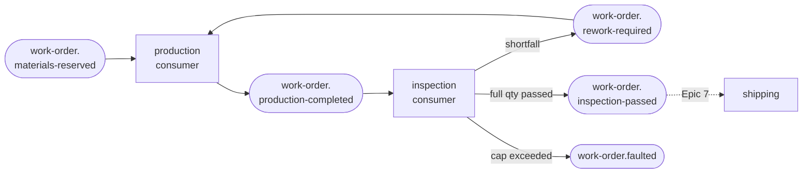

## [EPIC] Production and inspection workflow

**Labels:** epic, messaging, backend, domain
**Milestone:** M4

## Summary

The middle of the pipeline: picked work orders move through production (InProcess) and quality inspection, with per-unit pass/fail outcomes and a scrap-and-rebuild loop for failures.

## Why

Production and inspection give the lifecycle its substance and introduce the first *legitimate* failure path — a unit that fails inspection — which the Fault state has been waiting for. It is also the first stage that can run **more than once per work order**, which breaks the neat idempotency trick Epic 5 got away with and forces a real dedupe design.

## Scope

- Production consumer on `work-order.materials-reserved`: advance Scheduled → InProcess, build the ordered quantity as serialized units, publish completion
- Per-unit build tracking: each `StockKeepingUnit` produced is serialized, owned by the work order, and carries its own state
- Inspection stage: each unit passes or fails independently; failures carry a reason
- Scrap and rebuild: failed units are scrapped, the order returns to InProcess, and only the shortfall is rebuilt — the order advances to Delivery only at full passing quantity
- Rebuild cap: too many failed attempts routes the order to Fault, recoverably
- Idempotent consumption for stages that legitimately repeat

## The shape of it

The rebuild loop is a genuine cycle over the bus, not a method call:

Each subscriber binds the exact routing keys it acts on — the outcome *is* the routing key, so no consumer has to receive an event and then decide the event wasn't for it. This is the direct exchange doing the job [docs/messaging-topology.md](../../messaging-topology.md) argues for.

## Acceptance Criteria

- [x] Picked work orders progress through InProcess via events
- [x] Every ordered unit exists as a serialized `StockKeepingUnit` owned by the work order, with its own state
- [x] Inspection produces explicit per-unit pass/fail outcomes with reasons
- [x] Failed inspections route the work order to a defined, recoverable path (scrap → rebuild shortfall → re-inspect)
- [x] A work order reaches Delivery only when the full ordered quantity has passed inspection
- [x] Repeated rebuild failures land the order in Fault rather than looping forever
- [x] Redelivery of any production or inspection event has no additional effect
- [x] Every stage transition appears in the work order's state history

## Stories

- [6.1 — Serialized units and the production consumer](6.1.md)
- [6.2 — Inspection stage and per-unit verdicts](6.2.md)
- [6.3 — Scrap, rebuild, and the Fault cap](6.3.md)
- [6.4 — Idempotent consumption for repeating stages](6.4.md)

## Decisions taken at grooming

Interviewed and settled before the stories were written:

- **Per-unit scrap and rebuild.** Units pass or fail independently. A failed unit is scrapped with a reason; the order returns to InProcess and rebuilds *only the shortfall*, advancing to Delivery when the full quantity has passed. Fault is not used for a normal inspection failure — see the cap below.
- **Inspection is per serialized unit**, not per order. This is what makes serialization mean something, and it gives Epic 12's "fail an inspection" injection a specific target.
- **Production completes instantly** in this epic. No timers, no delays, no `due at` sweeper — Epic 10's simulation engine owns pacing. Epic 6 is about state and events; adding a sleeping handler now would also block the single prefetch-1 consumer for no benefit.
- **Verdicts come from a configurable auto-inspector plus an API override.** Failure rate defaults to `0.0` (everything passes) so the unattended pipeline flows; a `POST` endpoint records a verdict by hand, which is the visitor's decision moment and the hook Epic 12 reuses instead of inventing a back door.
- **Rebuild attempts are capped** (configurable, default 3). Exceeding the cap sends the order to Fault with the scrap history as the reason — the first legitimate use of Fault, and it is already releasable and cancellable.

## Decisions taken at implementation

- **Rebuilds consume no new materials** (the grooming's open question, settled at 6.3 as option 1 of three). The original pick covers the whole order; scrapped parts are notionally salvaged. Zero schema change to Epic 5's design. **Known simplification**, revisited in Epic 13 alongside multi-level BOMs — the honest fix is widening `material_reservations` to `(WorkOrderId, AttemptNumber)` so reservations, builds and dedupe are all attempt-scoped.
- **A guarded `WorkOrder.Fault(by, reason)` was added** rather than calling `SetStatus` from a worker. 6.3 flagged the discomfort as a signal, and it was: `SetStatus` is the unguarded superuser override, and routing to Fault is now a real transition that refuses terminal states and demands a reason.
- **Auto-inspection is switchable (`Inspection:AutoInspect`, default true).** Not in the grooming, but forced by it: with `FailureRate` at 0.0 the auto-inspector verdicts every unit inside the same handler that advances the order into Inspection, so the manual endpoint would have had nothing left to judge and would have 409'd forever. With auto-inspection off, units reach Inspection and wait for a human — which is what makes the visitor's decision moment actually reachable.
- **The dedupe key is `(WorkOrderId, AttemptNumber)`** on two new tables, `production_runs` and `inspection_runs`. `inspection_runs` is not redundant with 6.2's per-unit guard: the unit guard stops re-verdicting a unit, but only an attempt-scoped key stops a redelivered `ProductionCompleted` re-deciding the *order-level* outcome.
- **Units survive cancellation** (6.1's open question). With an owning FK, clearing the collection would delete serialized units; a cancelled order silently erasing the record of what it manufactured is worse than keeping it.

## Notes

The rework model is the most interesting domain decision in the pipeline and is worth writing up for the portfolio (Epic 16) — including the idempotency consequence in 6.4, which is a better story than Epic 5's precisely because the easy trick doesn't work.
