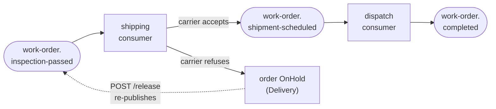

## [EPIC] Shipping and delivery workflow

**Labels:** epic, messaging, backend

## Summary

Schedule shipment of completed units and close out the work order — the happy path's satisfying ending.

## Why

Completes the end-to-end lifecycle, giving the demo a full story to tell and the timeline view its final chapters.

## Scope

- Shipment scheduling after inspection passes (virtual carrier, virtual dates)
- Delivery → Completed transition driven by events
- Shipping failure path defined (no carrier capacity → OnHold) **and recoverable — release re-requests the booking**
- Work order timeline endpoint: the full journey — states, picks, builds, inspections, shipment — in one response

## The shape of it

Two consumers and one loop back through the API:

The work order is **already in Delivery** when shipping consumes — `InspectionService` advanced it. So booking transitions nothing on the aggregate; the parcel's own progress lives on the `Shipment`, and dispatch is what finally moves the order to Completed. Two clocks on one aggregate would have been the easy mistake here.

## Acceptance Criteria

- [ ] Shipping is requested automatically after successful inspection
- [ ] Successful shipping completes the work order
- [ ] Shipping failure path is defined and recoverable
- [ ] API exposes a clear work order timeline

## Stories

- [7.1 — Shipment booking and the carrier](7.1.md)
- [7.2 — Dispatch, completion, and the visitor's carrier choice](7.2.md)
- [7.3 — Carrier refusal, hold, and making release mean something](7.3.md)
- [7.4 — The work order timeline](7.4.md)

## Decisions taken at grooming

Interviewed and settled before the stories were written:

- **Two steps: book, then dispatch.** Booking creates the `Shipment` and publishes; a second consumer dispatches it and completes the order. A three-step model with an in-transit stage would need a timer or sweeper, and Epic 6 deferred all pacing to Epic 10's simulation engine.
- **The carrier can refuse, and refusal holds the order.** `ICarrierBooking` mirrors 6.2's `IVerdictSource` — configurable refusal rate, default `0.0`. Refusal → OnHold with a reason, acked, not faulted: no capacity is an external constraint, the same reading 5.3 took for a material shortage.
- **Release finally re-triggers something.** An order released back into Delivery with no shipment re-requests booking. Narrow on purpose — releases into any other status stay inert, and the general "releases re-arm the pipeline" answer belongs to Epic 10. This is the least dangerous re-trigger in the system to build first: one event, no attempt counter, no partial work behind it.
- **The visitor chooses the carrier.** `Shipping:AutoBook` (default true) keeps the pipeline unattended; off, the order waits in Delivery for `POST /work-orders/{id}/shipments`. Same two-paths-one-resolution shape as 6.2's verdict endpoint, which is already proven.
- **The timeline is derived from existing records, not from a persisted event log.** A log table is a second write next to the work — the dual-write problem Epic 8's outbox exists to solve — so building it here would pre-empt that design with a worse version of it. Epic 8's outbox persists events anyway; the response shape is designed so an `event` kind can be merged in later.

## A note on idempotency

There is **no fourth idempotency story here**, and that is the interesting part. 6.4 argued the dedupe key must follow *the thing that must happen once*; for production that was an attempt, so the key went attempt-scoped. Shipping happens exactly once per order, so the key goes back to order-scoped — a unique index on `shipments.work_order_id`, Epic 5's trick unchanged — and dispatch needs no key at all, because the shipment's own `Booked → Dispatched` transition is already a once-only guard. Idempotency folds into 7.1 and 7.2 rather than earning a story.

## Notes

The timeline endpoint is the seed of Epic 11's trace view — design its shape with the dashboard in mind.

7.3 is where the epic earns its portfolio value. Booking and completing is plumbing; a recoverable hold that a human can un-stick, with the idempotency guarantees holding up when a stage is deliberately re-entered, is the reliability story Epic 8 then generalises.
