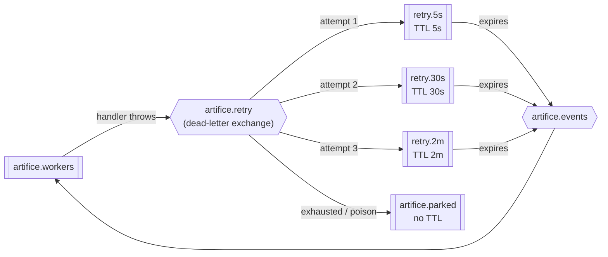

## Retry with backoff, poison messages, and the parked queue

**Labels:** messaging, backend, reliability

## Summary

Replace `nack(requeue: false)` — the deliberate first-slice policy from 4.2 that *drops* every failed message — with a real failure taxonomy: business outcomes ack (unchanged), transient faults retry with backoff through broker-native delay queues, and permanent faults go straight to a parked queue. Nothing is silently dropped again.

## Why

Today a single unlucky database blip loses a message and strands an order, and the topology doc has an apology in it saying so. 8.1 guarantees the event gets *sent*; this story guarantees a failed *handling* gets another chance. Together they are the reliability claim.

It is also the machinery Epic 12 puts on stage. Failure injection is only interesting if there is visible, correct recovery behind it — retries counting up and a message landing in a parked queue is the demo.

## The shape of it

A message that expires in a delay queue is dead-lettered back to `artifice.events` with its **original routing key**, so it re-enters the normal pipeline with no special-case code in the consumer. The delay is the queue's TTL; the ladder position comes from the death count RabbitMQ itself maintains.

## Tasks

- [ ] Declare the retry topology alongside the existing queue: a dead-letter exchange `artifice.retry`, three delay queues (`retry.5s`, `retry.30s`, `retry.2m`) each with a message TTL and `x-dead-letter-exchange` back to `artifice.events`, and `artifice.parked` with no TTL and no consumer of its own. Declared in code next to the existing bindings, idempotently, so a fresh broker comes up complete
- [ ] Classify the failure in the consumer loop before deciding where to send it:
  - **business outcome** → ack (the existing table in the topology doc is already the source of truth — do not disturb it)
  - **transient** (broker/DB errors, timeouts, `DbUpdateConcurrencyException` from 8.1) → publish to the next rung of the ladder, ack the original
  - **permanent / poison** (body won't deserialize, unknown event type, a payload whose ids don't exist) → straight to `artifice.parked`, **no retries** — replaying a parse failure five times is five identical failures
- [ ] Attempt counting from the `x-death` header RabbitMQ maintains, with an explicit `x-attempt` header as the readable version. Cap at the ladder's length (3), then park
- [ ] Preserve the correlation id and original routing key through every hop — a retried message must still `grep` as one story with its original request, and a parked message must carry enough to be replayed by 8.3 without archaeology
- [ ] Log every transition at information level with attempt number and delay, and the park at warning: this is exactly the log Epic 12's audience will be watching
- [ ] **A poison message must not wedge the consumer.** With prefetch 1, a message that throws on every delivery and requeues is a permanent stall — prove it can't happen: a deliberately malformed body parks on first sight and the next message is handled normally
- [ ] Tests: a handler that fails twice then succeeds completes on retry 3 with the work done exactly once (the dedupe keys must hold across retries — this is their first real exercise); a handler that always fails parks after 3 attempts and is never seen again; a malformed body parks immediately without retrying; a parked message left the work queue empty
- [ ] Update [docs/messaging-topology.md](../../messaging-topology.md): the retry topology diagram, the three-way classification replacing "nack without requeue", and the deletion of the "Epic 8 revisits this policy" note — this *is* that revisit

## Acceptance Criteria

- [ ] A transient failure retries with increasing backoff and succeeds without duplicating work
- [ ] A permanent failure parks immediately, without burning the retry ladder
- [ ] A retry-exhausted message parks and stops
- [ ] A poison message never blocks the queue behind it
- [ ] Retried work is idempotent — the existing dedupe keys hold across the whole ladder
- [ ] Every retry and every park is logged with its attempt count and correlation id

## Decisions (to confirm at story start)

- **Broker-native delay queues, not in-process backoff.** With prefetch 1, sleeping inside a handler holds the un-acked message and stalls the entire pipeline for the length of the backoff — and a worker restart loses the retry outright. TTL'd queues survive restarts, cost nothing while waiting, and are visible in the RabbitMQ management UI, which both Epic 11 and Epic 12 want to point at.
- **A fixed three-rung ladder, not computed exponential delays.** Per-message TTL on a shared queue does not expire out of order (RabbitMQ only checks the head), which is the classic trap here. Three queues with fixed TTLs sidestep it entirely and are trivial to draw.
- **The classification lives in the consumer loop, not in handlers.** Handlers already signal business outcomes by returning normally; anything that throws is the loop's problem to categorise. Pushing this into handlers would put retry policy in six places.
- **Parked is a real queue, not a log line.** 8.3 needs something durable to drain and replay.

## Notes

Depends on 8.1 only for the `DbUpdateConcurrencyException` classification; the rest is independent. If 8.1 slips, this story still lands — the conflict case just doesn't exist yet.

Watch the interaction with 8.1's at-least-once publishing: a retried delivery and an outbox republish are the *same* situation from the handler's point of view, and both are answered by the dedupe keys. If a test here needs a new guard to pass, that is a genuine finding about 6.4's keys, not a reason to weaken the retry.
