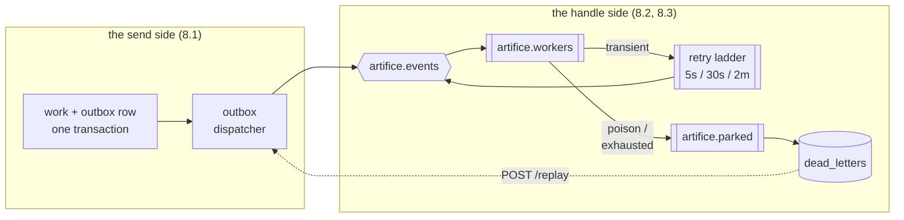

## [EPIC] Reliability and recovery

**Labels:** epic, reliability, backend
**Milestone:** M4

## Summary

Retries, dead-letter handling, API idempotency, and recovery mechanisms across the whole pipeline.

## Why

Reliability is the difference between a toy async system and a credible backend portfolio piece — and it's the machinery Epic 12's failure injection will put on stage.

Epic 7 sharpened the case. The at-most-once publish gap now spans six stages, so a single dropped event strands an order with no retry and no signal. **The demo's worst failure mode is silence**, and this epic is how it stops being possible.

## Scope

- Transactional outbox so a state change and its event commit together
- Transient failure retry policy (with backoff) on consumers
- Dead-letter queue for permanent failures, with inspection tooling
- API idempotency keys so client retries can't double-create work orders
- Reprocessing: failed/dead-lettered work can be examined and requeued
- Poison message handling: a malformed message can't wedge a consumer
- Optimistic concurrency on `WorkOrder` — the open decision since 3.4

## The shape of it

Two new pieces of infrastructure, on either side of the broker:

Read left to right it is one claim: **an event cannot be lost between the work that caused it and the handler that acts on it**, and if the handler genuinely cannot cope, a human can see why and put it back.

The replay arrow closing back onto the outbox dispatcher is the detail worth noticing — recovery publishes the same way everything else does. The one endpoint whose job is "reliably re-send this" would be an odd place to publish unreliably.

## Acceptance Criteria

- [x] A state change and its event are never separated — no event can be dropped after a commit
- [x] Transient failures retry with backoff and eventually succeed or dead-letter
- [x] Permanent failures dead-letter cleanly without blocking the queue
- [x] API idempotency keys prevent duplicate effects
- [x] Failed work can be inspected and optionally reprocessed via API
- [x] Concurrent updates to one work order are rejected, not silently merged

## Stories

- [8.1 — Transactional outbox, and the work order's first concurrency token](8.1.md)
- [8.2 — Retry with backoff, poison messages, and the parked queue](8.2.md)
- [8.3 — Dead letters: inspect, and put it back](8.3.md)
- [8.4 — API idempotency keys on work order creation](8.4.md)

## Decisions taken at grooming

Interviewed and settled before the stories were written:

- **Outbox for every publisher, drained by a poller.** Both API and worker write the event in the same `SaveChanges` as the work; a ~1s background dispatcher publishes unsent rows with `FOR UPDATE SKIP LOCKED`. Not signalled-after-commit: two paths to the same publish, and the fast one is the one that skips on crash. Not worker-only: the API is where the pipeline starts, and a dropped `work-order.scheduled` strands an order before it has moved at all.
- **Retry lives in the broker, not in the handler.** A dead-letter exchange feeding three TTL'd delay queues (5s / 30s / 2m) that expire back into `artifice.events` under the original routing key. With prefetch 1, an in-process backoff holds the un-acked message and stalls the whole pipeline, and a restart loses the retry outright. A fixed ladder also sidesteps the per-message-TTL head-of-line trap.
- **Dead letters become rows, not a queue to browse.** A dedicated drain consumer moves `artifice.parked` into a `dead_letters` table, so `GET /dead-letters` and `POST /dead-letters/{id}/replay` are ordinary queries. Survives a purge, joins to the work order, and gives Epic 11 something to render without AMQP in a browser.
- **API idempotency keys on create only.** Every other write endpoint is already idempotent by construction — state-machine transitions, the per-unit inspection guard, the shipment unique index — and 7.x proved it. Keys elsewhere would buy a nicer error message for a write per request.
- **The work order finally gets a concurrency token**, folded into 8.1 rather than given its own story, because 8.1 is already touching every commit path. A `DbUpdateConcurrencyException` is then classified as *transient* and rides 8.2's retry ladder: a lost update becomes a retried delivery, which is precisely what the retry machinery is for.

## A note on what the outbox actually buys

It does **not** make delivery exactly-once. The dispatcher can crash between publishing and marking a row sent, so a row can publish twice — the outbox converts **loss into duplication**.

That is the right trade only because duplication is already solved. Epics 5–7 built a dedupe key at every stage (`material_reservations.work_order_id`, `(work_order_id, attempt_number)` on the run tables, `shipments.work_order_id`, and dispatch's state machine), each of them a constraint that commits with its work. This epic is where that groundwork gets spent: retries, redeliveries, and replays are all the same situation from a handler's point of view, and all three are answered by keys that already exist.

If a test in 8.2 or 8.3 needs a *new* guard to pass, that is a genuine finding about 6.4's keys — not a reason to weaken the retry.

## As built — where the implementation departed from the plan

All four stories landed. Five decisions were made during the work that the grooming had left open
or had guessed differently:

- **One migration, not three.** `ReliabilityAndRecovery` carries `outbox_messages`, `dead_letters`
  and `idempotency_keys`, matching Epics 6 and 7's one-migration-per-epic shape. The `xmin`
  mapping needs no DDL at all — and the scaffolder's `AddColumn("xmin")` had to be deleted by
  hand, because Postgres rejects adding a column that collides with a system one. There is a note
  in the migration saying so.
- **The retry ladder is three fanout exchanges, not one direct `artifice.retry`.** A delay queue
  dead-letters on expiry using the message's *own* routing key, and that key must still be the
  original event type or the message returns unroutable. A direct retry exchange would have to
  spend the routing key selecting the rung. Encoding the rung in the exchange instead is what
  lets a retried message re-enter the pipeline with no special-case code in the consumer.
- **Three retries, four deliveries.** "Cap at the ladder's length (3), then park" was ambiguous.
  As built: attempts 1–3 each climb a rung, and a fourth failure parks — so all three rungs are
  used, which is what the diagram clearly intended.
- **Picking's transaction grew to cover its announcement.** `TryReserve` gained a
  `stageWithReservation` callback so the state-history note and the `MaterialsReserved` outbox row
  commit *inside* the reservation transaction. Without it, picking would have been the one stage
  where the event was not atomic with the work. This also closes 5.2's smaller caveat about the
  note being a second save.
- **A second replay needs `?force=true`** (8.3 left this open). Not a safety interlock — the
  dedupe keys make a repeat replay a skip — but a second click is usually asking "did the first
  one work?", and that deserves an answer rather than another silent re-send.

One shape worth recording because it is the epic's thesis in miniature: a `POST /work-orders`
carrying an `Idempotency-Key` now commits **the work order, its outbox row, and the key** in a
single `SaveChanges`. The work, its announcement, and the marker that says it happened, in one
transaction.

## Notes

Everything built here should emit events/metrics about itself — retries and dead-letters are exactly what the demo wants to make visible later. Design for an audience.

8.1 is the load-bearing story and the largest; 8.2 depends on it only for the concurrency-conflict classification, 8.3 depends on 8.2's parked queue, and 8.4 is independent of all three. If the epic has to stop early, stopping after 8.2 still leaves the system strictly more reliable than Epic 7 left it.

This epic closes M4. After it, the pipeline is complete *and* trustworthy, and M5 can turn to making it watchable.
