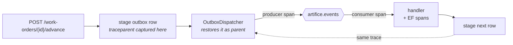

## Traces: one work order, one trace, across the broker

**Labels:** observability, backend, infra

## Summary

Stand up OpenTelemetry in both hosts and propagate W3C trace context across every hop the
pipeline makes — HTTP in, database, outbox, broker, handler, and back out again — so a single
work order's whole journey renders as one trace. Bring up `grafana/otel-lgtm` in
`docker-compose.yml` as the place to look at it.

## Why

The system now has six stages, two hosts, an outbox, a retry ladder and a parked queue. Epic 4's
correlation id can tell you *which* lines belong together; it cannot tell you what called what,
what ran in parallel, or where the 90 seconds went. A trace can, and it is the artifact that
makes "event-driven architecture" legible to someone who has ten minutes and no intention of
reading the code.

It is also the load-bearing story of the epic: 9.3's log lines carry trace ids, and the runbook
in 9.4 answers "what happened to work order X?" partly by handing over a trace link.

## The shape of it

**The outbox is where a naive integration silently breaks.** The event is *staged* inside the
request's activity but *published* by a background loop up to a second later, on a different
thread, with no ambient activity at all. If the dispatcher lets the SDK start a fresh root
activity, every trace in the system ends at the commit and an unrelated one-span trace begins in
the dispatcher — technically instrumented, completely useless.

`OutboxMessage` already makes exactly this argument about the correlation id ("if it stamped the
correlation id itself it would invent one, and 4.3's thread would end at the outbox"). Trace
context needs the same treatment for the same reason: **captured at stage time, restored at
publish time.**

## Tasks

- [ ] Add the OpenTelemetry packages and a shared `AddArtificeWorksTelemetry(...)` extension in
      Infrastructure that both hosts call — one place that sets the resource
      (`service.name` = `artificeworks.api` / `artificeworks.workers`, `service.version`,
      `deployment.environment`), the exporter, and the sampler. Two hosts configuring telemetry
      independently is how they drift
- [ ] Instrumentation from the box: ASP.NET Core, HttpClient, EF Core / Npgsql. Turn on
      `SetDbStatementForText` in development only — the statement text is the whole value of a DB
      span and is also the thing you don't ship to a hosted backend by default
- [ ] **Trace context across AMQP.** Inject `traceparent`/`tracestate` into the message headers on
      publish and extract them on delivery, using the standard `TraceContextPropagator` rather
      than hand-rolled headers. One producer span per publish and one consumer span per delivery,
      following the OTel messaging semantic conventions (`messaging.system`, `messaging.operation`,
      `messaging.destination.name`, `messaging.message.id`)
- [ ] **Carry trace context through the outbox** — this is the story's real work:
  - capture `Activity.Current` on the row when it is staged (new columns on `outbox_messages`,
    nullable, so existing rows are simply untraced)
  - restore it in `OutboxDispatcher` as the parent of the producer span before publishing
  - a row staged with no ambient activity (a background service, a test) must still publish
    cleanly — untraced, never broken
- [ ] **Correlation id becomes baggage** (the decision taken at grooming). The 4.3 correlation id
      survives unchanged as the human-facing id; it additionally rides in OTel baggage and is
      stamped on spans as `artificeworks.correlation_id`, so a trace and a log grep can be joined
      in either direction. `CorrelationMiddleware` and the consumer loop are the two places that
      set it
- [ ] Domain attributes on the spans that have them: `artificeworks.work_order_id`,
      `artificeworks.event_type`, `artificeworks.attempt`. These are what make a trace searchable
      by the thing a visitor actually knows — an order number
- [ ] The retry ladder must not fragment the trace. A message that climbs a rung and comes back is
      the *same* work; it should appear as further consumer spans under the original trace, with
      `artificeworks.attempt` distinguishing them — not as three unrelated traces
- [ ] `grafana/otel-lgtm` in `docker-compose.yml` (OTLP on 4317/4318, Grafana on 3000), with the
      OTLP endpoint configured in both hosts' `appsettings.Development.json`. **Telemetry must be
      optional:** no collector running is a warning at startup, never a failure to boot, and never
      a stall on a blocked exporter
- [ ] Tests: a publish→consume round trip over a real broker (Testcontainers, the existing
      `WorkerConsumerTests` rig) asserts the consumer-side activity has the producer's trace id and
      the correct parent span id; an outbox row staged inside an activity and dispatched after it
      has ended still publishes under the original trace id; a row staged with no activity
      publishes fine

## Acceptance Criteria

- [ ] One work order driven from `POST` to Completed produces **one** trace spanning both services
- [ ] Trace context survives the outbox — no trace ends at a commit
- [ ] Spans carry the correlation id and the work order id as attributes
- [ ] A retried delivery joins the original trace rather than starting a new one
- [ ] Both services export to a single OTLP endpoint brought up by `docker compose up -d`
- [ ] With no collector reachable, both hosts start and run normally

## Decisions (to confirm at story start)

- **`grafana/otel-lgtm`, one container.** Collector, Tempo, Loki, Prometheus and Grafana in a
  single image behind one OTLP endpoint. Three separate containers would be more explicit but is
  three configs to maintain and self-host in M7; the Aspire dashboard is prettier but keeps
  nothing, and 9.2's metrics want retention.
- **Parent-child across the broker, not span links.** The pipeline is a causal chain, and the
  question the demo answers is "where is this order and what has it cost so far" — that is a
  waterfall. Links model fan-in, which this system does not do. A consequence worth accepting up
  front: with the retry ladder a trace can legitimately stay open for minutes.
- **Keep the correlation id; carry it as baggage.** Replacing it with the trace id would rewrite
  4.3, change the API's `X-Correlation-ID` contract, and hand the demo a 32-hex string where it
  had a memorable id. Baggage costs a header and joins the two worlds.
- **Trace context lives on the outbox row, not inside the envelope payload.** The payload is the
  domain event and is replayed verbatim by 8.3; stuffing transport metadata into it would mean a
  replayed event carries a stale, long-closed trace. Columns are also queryable, which matters for
  9.4's runbook.

## Notes

Depends on nothing; everything else in the epic depends on some part of it. If the epic stops
after this story, the system is already meaningfully more observable than Epic 8 left it.

Watch the interaction with 8.3's replay: a replayed dead letter is a *new* attempt at old work.
It should get a new trace, ideally linked to the original — a rare case where a span link is
genuinely the right relationship. Don't over-build it here; note it and let 9.4's runbook say
which trace to look at.
