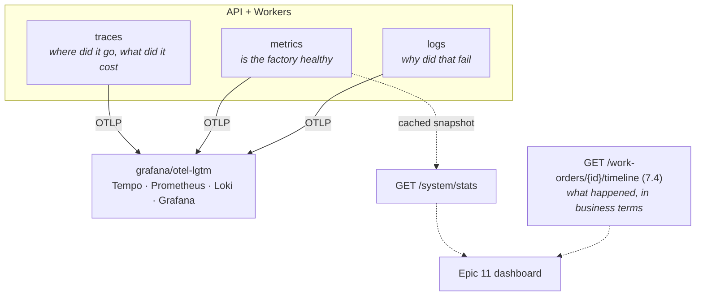

## [EPIC] Observability

**Labels:** epic, observability, infra
**Milestone:** M5

## Summary

Structured logging, metrics, and tracing so one work order can be followed through every stage of
the pipeline.

## Why

Observability makes the async workflow understandable — for debugging, and as the raw material the
demo dashboard turns into visuals.

Epic 8 sharpened the case in the opposite direction to Epic 7. The pipeline is now *reliable*:
events are staged transactionally, failures climb a retry ladder, and what can't be handled parks
as a row. **None of that is visible.** An outbox backlog, a message on rung two, an order stuck in
Inspection and an order that finished ten seconds ago all look identical from outside the process.
Epic 8 built the machinery; this epic is what puts a window in front of it — and Epic 12's failure
injection is only a demo if there is something to watch.

## Scope

- Structured logging with correlation IDs on every log line, API and workers alike
- Metrics: throughput, failure counts, retry counts, queue depths per stage
- Distributed tracing (OpenTelemetry) spanning API → broker → worker
- A documented way to answer "what happened to work order X?" end to end

## The shape of it

Two ids and four surfaces, each owning a different question:

The fourth surface is the one that already exists: 7.4's timeline is the *business* answer, built
from persisted records. Traces, metrics and logs are the *machine* answer. Keeping them distinct is
deliberate — the visitor-facing dashboard should never have to render a span waterfall to say an
order passed inspection.

The dotted line into `/system/stats` is the other structural claim: instrument once, and give the
dashboard a plain JSON mirror rather than making a React app speak PromQL.

## Acceptance Criteria

- [ ] Correlation IDs are logged consistently across services
- [ ] Metrics expose throughput/failure/retry counts per pipeline stage
- [ ] One work order can be traced through multiple stages
- [ ] Local setup for viewing logs/metrics/traces is documented

## Stories

- [9.1 — Traces: one work order, one trace, across the broker](9.1.md)
- [9.2 — Metrics: the factory's vital signs, and a feed for the dashboard](9.2.md)
- [9.3 — Logs: structured, correlated, and worth reading](9.3.md)
- [9.4 — Health, readiness, and "what happened to work order X?"](9.4.md)

## Decisions taken at grooming

Interviewed and settled before the stories were written:

- **`grafana/otel-lgtm`, a single container.** Collector, Tempo, Loki, Prometheus and Grafana
  behind one OTLP endpoint. Three separate containers (Prometheus + Grafana + Jaeger) is the more
  conventional split but is three configs to maintain and self-host in M7; the Aspire dashboard is
  the nicest UI but keeps nothing between restarts, and 9.2's metrics want retention.
- **The correlation id survives, carried as OTel baggage.** `traceparent` becomes the transport for
  causality; the 4.3 correlation id stays as the human-facing, demo-visible id and is stamped on
  spans as well as log lines. Replacing it with the trace id would rewrite 4.3, change the API's
  `X-Correlation-ID` contract, and hand a visitor a 32-hex string where they had a memorable id.
- **Metrics *and* a snapshot endpoint.** Instrument once with `System.Diagnostics.Metrics` for
  Grafana; expose `GET /system/stats` as a cheap JSON mirror for Epic 11. The alternative pushes a
  query language, a CORS problem and an auth problem into the frontend epic to save an endpoint
  that is a few dozen lines over data that already exists.
- **Health checks and the runbook belong to this epic** (9.4), not to Epic 15. `/health` has
  returned an unconditional "Healthy" since Epic 1 — it reports fine with Postgres down — and the
  "documented way to answer *what happened to work order X?*" is an acceptance criterion that
  otherwise has no owner. The checks are nearly free once every dependency is already in the
  container.

## The one that isn't obvious: the outbox breaks traces

8.1 moved every publish from *after* the commit to *staged inside* it, and a background dispatcher
puts the row on the wire up to a second later — on another thread, with no ambient activity.

A default OpenTelemetry setup therefore produces something worse than no tracing: every trace ends
neatly at the commit, and the dispatcher starts a fresh, parentless one-span trace for each
publish. Fully instrumented, entirely disconnected, and it *looks* correct until you try to follow
an order across a stage boundary.

`OutboxMessage` already makes exactly this argument about the correlation id — "if it stamped the
correlation id itself it would invent one, and 4.3's thread would end at the outbox". Trace context
needs the same answer for the same reason: **captured at stage time, restored at publish time.**
That is the load-bearing detail of 9.1, and the reason 9.1 goes first.

## Notes

Prefer OpenTelemetry conventions — resume-relevant and tool-agnostic. The dashboard (Epic 11)
consumes the same signals; don't build bespoke plumbing it can't reuse.

**Telemetry must never be load-bearing.** No collector reachable is a startup warning, not a
failure to boot, and never a blocked exporter stalling a handler. The pipeline's reliability
guarantees come from Epic 8 and must not acquire a dependency on the thing that watches them.

Sequencing: 9.1 is load-bearing (shared telemetry registration, trace context, the compose
container). 9.3 depends on it for trace ids; 9.2 depends on it only for exporter wiring and
otherwise stands alone; 9.4's health checks are independent, though its runbook documents all
three. Stopping after 9.1 already leaves the system meaningfully more observable than Epic 8 left
it.

This epic opens M5. After it the pipeline is watchable — which is what Epic 10's simulation needs
in order to be trusted, and what Epic 11 renders.
