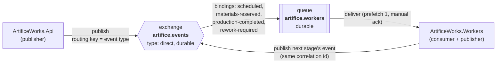
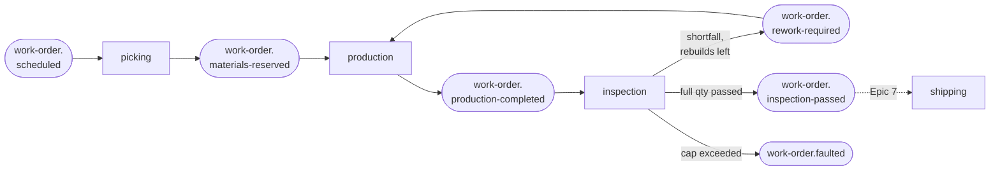
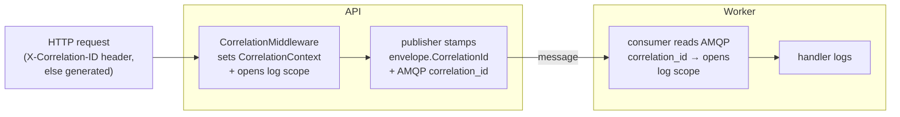

# Messaging topology

How ArtificeWorks moves events from the API to the workers over RabbitMQ, and how a
single correlation id threads one work order's story through both services' logs.

This document is the source of truth for the broker layout. You should be able to draw the
exchanges, queues, and bindings from it without reading code.

## At a glance

The worker is **both** a consumer and a publisher, and since Epic 6 it is the only thing
driving the pipeline: one HTTP call schedules an order, and every stage after that is
triggered by the event the previous stage published. The worker publishes to the same exchange
it consumes from, so `work-order.rework-required` goes *out* to the broker and comes back — the
rework loop is a genuine cycle over the transport, not a method call in a handler.

## The pipeline

Each subscriber binds the exact routing keys it acts on, so **the outcome is the routing key**:
no consumer receives an event and then decides the event wasn't for it. That is the direct
exchange earning its place.

Two of these keys currently have no subscriber. `work-order.inspection-passed` waits for Epic
7's shipping consumer; `work-order.faulted` is announced for the dashboard (Epic 11) because a
faulted order is a recoverable state a human is expected to act on, and nothing in the pipeline
will move it again on its own.

## Exchange

| Property | Value |
| --- | --- |
| Name | `artifice.events` |
| Type | `direct` |
| Durable | yes |
| Auto-delete | no |

There is **one** exchange for the whole system. Every event is published to it with the
**event type as the routing key** (e.g. `work-order.scheduled`). A direct exchange routes a
message only to queues bound with a routing key equal to the message's — so a queue opts in
to exactly the event types it names, and nothing else.

Why direct (not topic or fanout): routing keys here are exact, flat event-type strings with
no wildcard subscriptions, and not every consumer should see every event. Direct is the
simplest exchange that gives per-event-type subscription. If a future consumer needs
pattern subscriptions (`work-order.*`), that's the point to revisit topic.

The exchange is declared by the shared connection on first use
([`RabbitMqConnection`](../src/ArtificeWorks.Infrastructure/Messaging/RabbitMqConnection.cs)),
so whichever service starts first declares it; the declaration is idempotent.

## Queues and bindings

| Queue | Durable | Bound routing keys | Consumer |
| --- | --- | --- | --- |
| `artifice.workers` | yes | one per handled event type — `work-order.scheduled`, `work-order.materials-reserved`, `work-order.production-completed`, `work-order.rework-required` | `ArtificeWorks.Workers` |

### The full event set

| Routing key | Published by | Consumed by | Meaning |
| --- | --- | --- | --- |
| `work-order.created` | API | *(nobody yet)* | An order exists |
| `work-order.scheduled` | API | picking | Start picking materials |
| `work-order.materials-reserved` | worker (picking) | production | Build attempt 1 |
| `work-order.production-completed` | worker (production) | inspection | Judge the units this attempt built |
| `work-order.rework-required` | worker (inspection) | production | Rebuild the shortfall as attempt N+1 |
| `work-order.inspection-passed` | worker (inspection) | *(Epic 7: shipping)* | Full ordered quantity passed |
| `work-order.faulted` | worker (inspection) | *(Epic 11: dashboard)* | Rebuild cap exceeded; the cycle has stopped |

The worker owns a single durable queue. On startup it declares the queue and then binds it
to `artifice.events` **once per handled event type** — the set of bindings is derived from
the registered handlers, not hard-coded. Registering a new handler
(`AddEventHandler<TEvent, THandler>()`) adds its event type to that set, so the binding
appears automatically with no change to the consumer loop.

Only bound routing keys reach the queue. An event type with no handler is never delivered
(the direct exchange drops it for this queue), which is why the queue's bindings and the
worker's handler set are always the same list.

### Delivery and acknowledgement

- **Prefetch 1** — the worker holds at most one unacknowledged message at a time. Simple and
  fair for the current single-consumer slice.
- **Manual acks** — a message is acked only after its handler succeeds.
- **Nack without requeue on failure** — if a handler throws, the message is nacked with
  `requeue: false` and dropped. There is no dead-letter queue yet, so requeuing a poison
  message would loop forever. Epic 8 (reliability) adds a DLQ and revisits this policy.

### What counts as a failure

Only genuine faults nack. **Business outcomes ack**, because they were handled:

| Stage | Outcome | Message |
| --- | --- | --- |
| picking | Materials reserved | ack |
| picking | Insufficient stock → order placed OnHold with a reason | **ack** — a factory waiting on parts is a result, not an error |
| picking | Duplicate delivery → already picked, nothing done | **ack** — by definition already handled |
| production | Units built | ack |
| production | Order not producible (held, cancelled, attempt out of sequence) | **ack** — a state conflict is a result, not a fault |
| production | Duplicate delivery → attempt already built | **ack** |
| inspection | Verdicts applied, order advanced / returned to production | ack |
| inspection | **Units scrapped**, rework required | **ack** — the whole point of the epic; a failed unit is business, not error |
| inspection | **Rebuild cap exceeded → order faulted** | **ack** — a bounded, deliberate stop |
| inspection | Duplicate delivery → attempt already inspected | **ack** |
| any | Unexpected exception (broker/database fault, bug) | nack, `requeue: false` |

Keeping that line sharp is what stops normal business flow from polluting Epic 8's retry and
dead-letter design. Note especially that scrap and Fault ack: they are the pipeline working
as designed, and nacking them would put ordinary manufacturing failures into the poison-message
path.

### Idempotent consumption

At-most-once *publish* still meets at-least-once *delivery*: redeliveries happen on consumer
restarts and network hiccups, long before Epic 8 formalises reliability.

**Picking (Epic 5)** got its dedupe almost for free. Picking happens exactly once per work
order, so a **unique index on `material_reservations.work_order_id`** answers "has this been
done?" outright: a second delivery's insert fails and its inventory decrements roll back with
it. The dedupe marker and the reservation are the same row, so they commit atomically by
construction.

**That trick does not generalise**, and Epic 6 is where it breaks. Production legitimately runs
many times for one order — that is what the rework loop *is* — so "has this order been
produced?" stops being a question with an answer. An order-scoped key would make the rebuild
loop impossible.

What must happen exactly once is an **attempt**. So the key is attempt-scoped:

| Table | Unique key | Guards |
| --- | --- | --- |
| `material_reservations` | `work_order_id` | one pick per order |
| `production_runs` | `(work_order_id, attempt_number)` | one build per attempt |
| `inspection_runs` | `(work_order_id, attempt_number)` | one inspection per attempt |

The attempt number is **derived deterministically from the event**, never read from the order's
current state at handling time: `materials-reserved` always means attempt 1, and
`rework-required` for attempt N always means attempt N+1. A redelivery therefore computes the
same number and collides, where "look up what attempt we're on" would be exactly the
check-then-act race the key exists to close.

Each run row is written in the **same `SaveChanges`** as the work it describes — the new units
and the order's transition for production; the per-unit verdicts and the resulting transition
for inspection. So 5.4's best property survives: a losing duplicate does not merely fail to
record a marker, it takes its whole batch of work down with it. No inbox table, which would be
a second write that could drift from the work it claims to describe.

The per-unit "already inspected" guard is *not* sufficient on its own. It stops a redelivery
re-verdicting a unit, but not the order-level decision: without `inspection_runs`, a redelivered
`ProductionCompleted` could publish a second `InspectionPassed` or burn a second rebuild
attempt. Both layers are needed, and they cover different things.

Every skip is logged at information level and never silently swallowed, so Epic 12 can redeliver
a message on purpose in front of an audience and have it be visible.

## Message shape

Each message body is a JSON [`EventEnvelope<T>`](../src/ArtificeWorks.Application/Messaging/EventEnvelope.cs)
(camelCase, web defaults) wrapping the typed event payload. Alongside the body, these AMQP
basic properties are set by the publisher so a consumer or the management UI can triage
without deserializing:

| AMQP property | Value | Source |
| --- | --- | --- |
| `type` | event type (also the routing key) | `envelope.EventType` |
| `message_id` | unique id for this message | `envelope.EventId` |
| `correlation_id` | ties the message to one logical operation | `envelope.CorrelationId` |
| `content_type` | `application/json` | fixed |
| `delivery_mode` | persistent (2) | fixed — survives a broker restart on a durable queue |
| `timestamp` | publish time (unix seconds) | publisher clock |

## Correlation

A correlation id is the thread that ties one work order's whole story together across both
services. It flows in one direction, established once at the edge:

1. **Established at the API boundary.** `CorrelationMiddleware` honours an inbound
   `X-Correlation-ID` request header when it's a valid Guid, otherwise uses the fresh id the
   per-request `CorrelationContext` defaults to. The id is echoed back on the response's
   `X-Correlation-ID` header.
2. **Carried on the event.** The publisher stamps that id onto both `envelope.CorrelationId`
   and the AMQP `correlation_id` property of every event raised during the request.
3. **Resumed in the worker.** On each delivery the consumer reads the AMQP `correlation_id`
   and opens a logging scope with it — no need to deserialize the body first.
4. **In the logs on both sides.** Both services push the id into a logging scope under the
   same key (`CorrelationId`, see
   [`CorrelationLog`](../src/ArtificeWorks.Application/Messaging/CorrelationLog.cs)) with
   console scopes enabled, so **one `grep` of a correlation id returns every log line — API
   and worker — for that operation.**

5. **Carried forward on re-publish.** Since Epic 5 the worker publishes as well as consumes.
   Every handler adopts the inbound `envelope.CorrelationId` into the per-message
   `CorrelationContext` before running its workflow, so the event it emits goes out under the
   id the original HTTP request started with. Since Epic 6 that thread spans API → scheduled →
   picking → production → inspection → `inspection-passed`, round every revolution of the
   rework loop, and one `grep` still returns all of it.

## Related code

- Exchange + connection: [`RabbitMqConnection`](../src/ArtificeWorks.Infrastructure/Messaging/RabbitMqConnection.cs), [`RabbitMqConfiguration`](../src/ArtificeWorks.Infrastructure/Messaging/RabbitMqConfiguration.cs)
- Publisher: [`RabbitMqEventPublisher`](../src/ArtificeWorks.Infrastructure/Messaging/RabbitMqEventPublisher.cs)
- Consumer + queue/bindings: [`RabbitMqConsumerService`](../src/ArtificeWorks.Workers/Consuming/RabbitMqConsumerService.cs), [`EventDispatcher`](../src/ArtificeWorks.Workers/Consuming/EventDispatcher.cs)
- Correlation: [`CorrelationMiddleware`](../src/ArtificeWorks.Api/Middleware/CorrelationMiddleware.cs), [`CorrelationContext`](../src/ArtificeWorks.Application/Messaging/CorrelationContext.cs), [`CorrelationLog`](../src/ArtificeWorks.Application/Messaging/CorrelationLog.cs)
