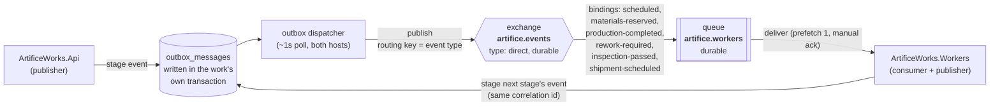
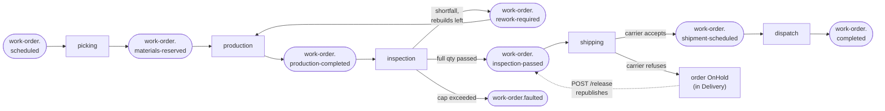
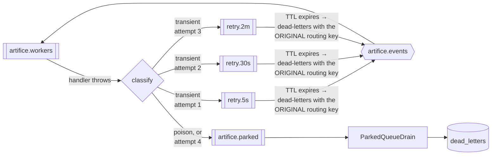
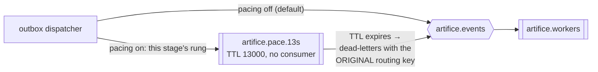
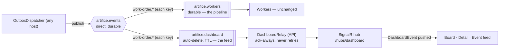
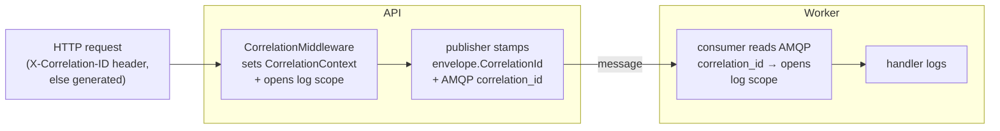

# Messaging topology

How ArtificeWorks moves events from the API to the workers over RabbitMQ, and how a
single correlation id threads one work order's story through both services' logs.

This document is the source of truth for the broker layout. You should be able to draw the
exchanges, queues, and bindings from it without reading code.

> **Watching it, rather than drawing it**, belongs to [observability.md](observability.md): traces,
> metrics, logs, the health probes, and "what happened to work order X?" worked end to end. This
> document still owns the correlation id's *contract* — where it comes from and how it crosses the
> wire — and that one owns what you do with it. One thing worth knowing here: since 9.1 the
> outbox row also carries a W3C `traceparent`, captured when the event is staged and restored when
> it is published, so a trace does not end at every commit.

## At a glance

The worker is **both** a consumer and a publisher, and since Epic 6 it is the only thing
driving the pipeline: one HTTP call schedules an order, and every stage after that is
triggered by the event the previous stage published. The worker publishes to the same exchange
it consumes from, so `work-order.rework-required` goes *out* to the broker and comes back — the
rework loop is a genuine cycle over the transport, not a method call in a handler.

Since Epic 7 the pipeline runs to its end: **one `POST /work-orders/{id}/advance` carries an
order all the way to Completed**, with a parcel and a tracking number at the far side.

**Since Epic 8 nothing gets there by luck.** Nobody publishes directly any more: every publisher
writes an outbox row in the same transaction as the work, a background dispatcher puts those rows
on the wire, a failed handling climbs a retry ladder rather than being dropped, and whatever
genuinely cannot be handled ends up as a row a human can read and replay. The three sections
below — [The outbox](#the-outbox-send-side), [Retry, poison and the parked
queue](#retry-poison-and-the-parked-queue) and [Dead letters](#dead-letters-and-replay) — are the
whole of that claim.

## The pipeline

Each subscriber binds the exact routing keys it acts on, so **the outcome is the routing key**:
no consumer receives an event and then decides the event wasn't for it. That is the direct
exchange earning its place.

Two keys have no *pipeline* subscriber, both deliberately. `work-order.faulted` and
`work-order.completed` are *announcements*: one is a recoverable state a human is expected to act
on, the other is the terminal "and that's the end of it". Nothing in the pipeline acts on either.
Since 11.2 they do have **one** reader — the dashboard relay below — which was always their point:
they were left orphaned through Epics 7–8 so the Epic 11 feed would be their first subscriber.

### `work-order.inspection-passed` has two publishers

Worth noticing, because it is the only key that does. The inspection worker publishes it when a
full quantity passes — and since 7.3 **the API publishes it too**, when a visitor releases an
order held at Delivery that has no shipment. That release would otherwise be a state change
leading nowhere: inspection has already passed the order and nothing will move it again.

The consumer neither knows nor cares which publisher a delivery came from, which is the point.
The alternative — a `shipping-requested` key with the same consumer behind it — is arguably more
honest but is one more contract for one more caller, and the payload really is "these units
passed inspection".

The re-trigger is **narrow on purpose**: only a release that lands in Delivery *with no shipment*
republishes. Releases into any other status stay inert, as 5.3 and 6.3 left them. The general
answer (releases anywhere re-arm the pipeline) belongs to Epic 10's simulation engine, which can
own a retry policy.

## Exchange

| Property | Value |
| --- | --- |
| Name | `artifice.events` |
| Type | `direct` |
| Durable | yes |
| Auto-delete | no |

There is **one** exchange for the whole system. Every event is published to it with the
**event type as the routing key** (e.g. `work-order.scheduled`). A direct exchange routes a
message only to queues bound with a routing key equal to the message's — so a queue opts in
to exactly the event types it names, and nothing else.

Why direct (not topic or fanout): routing keys here are exact, flat event-type strings with
no wildcard subscriptions, and not every consumer should see every event. Direct is the
simplest exchange that gives per-event-type subscription. If a future consumer needs
pattern subscriptions (`work-order.*`), that's the point to revisit topic.

The exchange is declared by the shared connection on first use
([`RabbitMqConnection`](../src/ArtificeWorks.Infrastructure/Messaging/RabbitMqConnection.cs)),
so whichever service starts first declares it; the declaration is idempotent.

## Queues and bindings

| Queue | Durable | Bound to | Consumer |
| --- | --- | --- | --- |
| `artifice.workers` | yes | `artifice.events`, one binding per handled event type — `work-order.scheduled`, `work-order.materials-reserved`, `work-order.production-completed`, `work-order.rework-required`, `work-order.inspection-passed`, `work-order.shipment-scheduled` | `ArtificeWorks.Workers` |
| `artifice.retry.5s.queue` | yes | `artifice.retry.5s` (fanout) | *(none — TTL 5s, then dead-letters to `artifice.events`)* |
| `artifice.retry.30s.queue` | yes | `artifice.retry.30s` (fanout) | *(none — TTL 30s)* |
| `artifice.retry.2m.queue` | yes | `artifice.retry.2m` (fanout) | *(none — TTL 2m)* |
| `artifice.parked` | yes | *(default exchange, by name)* | `ParkedQueueDrain` — writes `dead_letters` rows and nothing else |
| `artifice.dashboard` | **no** (auto-delete, `x-message-ttl`) | `artifice.events`, one binding per **published** event type — the full `WorkOrderEventTypes.All` set, including `created`, `faulted`, `completed` | `DashboardRelay` (API) — relays each event to browsers over SignalR (11.2) |

### The full event set

| Routing key | Published by | Consumed by | Meaning |
| --- | --- | --- | --- |
| `work-order.created` | API | *(nobody yet)* | An order exists |
| `work-order.scheduled` | API | picking | Start picking materials |
| `work-order.materials-reserved` | worker (picking) | production | Build attempt 1 |
| `work-order.production-completed` | worker (production) | inspection | Judge the units this attempt built |
| `work-order.rework-required` | worker (inspection) | production | Rebuild the shortfall as attempt N+1 |
| `work-order.inspection-passed` | worker (inspection) **and API (on release, 7.3)** | shipping | Full ordered quantity passed; book a carrier |
| `work-order.shipment-scheduled` | worker (shipping) | dispatch | A carrier accepted; hand the parcel over |
| `work-order.completed` | worker (dispatch) | **dashboard relay** (11.2) | Parcel dispatched, order closed — the last event in the chain |
| `work-order.faulted` | worker (inspection) | **dashboard relay** (11.2) | Rebuild cap exceeded; the cycle has stopped |

The worker owns a single durable queue. On startup it declares the queue and then binds it
to `artifice.events` **once per handled event type** — the set of bindings is derived from
the registered handlers, not hard-coded. Registering a new handler
(`AddEventHandler<TEvent, THandler>()`) adds its event type to that set, so the binding
appears automatically with no change to the consumer loop.

Only bound routing keys reach the queue. An event type with no handler is never delivered
(the direct exchange drops it for this queue), which is why the queue's bindings and the
worker's handler set are always the same list.

### Delivery and acknowledgement

- **Prefetch 1** — the worker holds at most one unacknowledged message at a time. Simple and
  fair for the current single-consumer slice, and the reason a retry can never be an in-process
  sleep: a sleeping handler holds the un-acked message and stalls everything behind it.
- **Manual acks** — a message is acked only after its handler succeeds, *or* after the loop has
  successfully handed it to the retry ladder or the parked queue.
- **Nothing is dropped.** Epic 4's `nack(requeue: false)` was a deliberate first-slice policy that
  threw failed messages away; 8.2 replaced it with the three-way classification below. The only
  nack left in the loop is `requeue: true`, used when the broker itself will not take the message
  we are trying to move — the one case where holding it beats dropping it.

### What counts as a failure

Only genuine faults leave the happy path. **Business outcomes ack**, because they were handled:

| Stage | Outcome | Message |
| --- | --- | --- |
| picking | Materials reserved | ack |
| picking | Insufficient stock → order placed OnHold with a reason | **ack** — a factory waiting on parts is a result, not an error |
| picking | Duplicate delivery → already picked, nothing done | **ack** — by definition already handled |
| production | Units built | ack |
| production | Order not producible (held, cancelled, attempt out of sequence) | **ack** — a state conflict is a result, not a fault |
| production | Duplicate delivery → attempt already built | **ack** |
| inspection | Verdicts applied, order advanced / returned to production | ack |
| inspection | **Units scrapped**, rework required | **ack** — the whole point of the epic; a failed unit is business, not error |
| inspection | **Rebuild cap exceeded → order faulted** | **ack** — a bounded, deliberate stop |
| inspection | Duplicate delivery → attempt already inspected | **ack** |
| shipping | Carrier accepted; parcel booked | ack |
| shipping | **Carrier refused → order placed OnHold with the reason** | **ack** — no capacity is an external constraint, the same reading picking takes for a shortage |
| shipping | `AutoBook` off → order waits in Delivery for a visitor's carrier choice | **ack** — a deliberate pause, not a failure |
| shipping | Order not in Delivery (already held, cancelled) | **ack** — a state conflict is a result |
| shipping | Duplicate delivery → order already booked | **ack** |
| dispatch | Parcel handed over, order Completed | ack |
| dispatch | Duplicate delivery → shipment already dispatched | **ack** |
| any | Unexpected exception (broker/database fault, bug, concurrency conflict) | **retry ladder**, then park |
| any | Body won't deserialize, or no handler for the routing key | **park immediately** |

Keeping that line sharp is what stopped normal business flow from polluting the retry and
dead-letter design. Note especially that scrap and Fault ack: they are the pipeline working
as designed, and retrying them would put ordinary manufacturing failures into the recovery path.

## Retry, poison and the parked queue

**Three rungs, three retries, four deliveries in all.** The original delivery, then 5s, 30s and 2m
later. A fourth failure parks and stops.

**Why one fanout exchange per rung, rather than one direct `artifice.retry`.** A delay queue
dead-letters on expiry using the message's *own* routing key, and that key has to still be the
original event type or the message comes back unroutable. A single direct retry exchange would
have to consume the routing key to select the rung — but the routing key is already spoken for. So
the rung is chosen by *exchange* and the routing key rides through untouched, which is what lets a
retried message re-enter the pipeline with **no special-case code in the consumer at all**.

**Why the broker holds the delay and not the handler.** With prefetch 1, sleeping inside a handler
holds the un-acked message and stalls the whole pipeline for the length of the backoff — and a
worker restart loses the retry outright. TTL'd queues survive restarts, cost nothing while
waiting, and are visible in the management UI, which is where Epic 12 will be pointing.

**Why fixed TTLs and not computed per-message ones.** Per-message TTL on a shared queue does not
expire out of order: RabbitMQ only ever checks the message at the head, so one long-delayed
message blocks every shorter one behind it. Fixed-TTL queues sidestep the trap entirely.

The attempt count travels in an `x-attempt` header we control, not in RabbitMQ's `x-death` table —
a message crossing three different delay queues accumulates three separate `x-death` entries, and
"add up the counts of the queues I happen to know about" is a worse contract than one integer.
`x-original-routing-key` and `x-death-reason` ride along too, so a parked message can be replayed
without archaeology.

**A poison message cannot wedge the queue.** Every branch acks the delivery it was given. With
prefetch 1, a message that threw and requeued would be redelivered forever and nothing behind it
would ever move — so a body that won't parse parks on first sight, and the next message is handled
normally. That is asserted, not assumed.

**An unknown routing key is poison, not a no-op.** The queue only binds handled keys, so a
delivery for an unknown one means the topology and the handler set have drifted apart. Acking that
away silently is how a message disappears without anyone finding out; it parks instead.

## Pacing (Epic 10)

The retry ladder has a twin: a **pace ladder** that adds *time on purpose* to the happy path, so a
demo has something to watch. An order that runs Intake → Completed in 40 milliseconds is a database
transaction with a state machine on top; pacing makes a pick take seconds and a build take longer,
without a handler ever sleeping.

It is deliberately **the same shape as the retry ladder, and for the same reasons** — one fanout
exchange plus one TTL'd queue per rung, dead-lettering back into `artifice.events` under the
message's own routing key, so a paced event re-enters the pipeline with no special-case code. See
[`BrokerTopology`](../src/ArtificeWorks.Infrastructure/Messaging/BrokerTopology.cs), which declares
both.

Four things worth knowing:

- **Pacing is applied in the outbox dispatcher, nowhere else.** Since Epic 8 the dispatcher is the
  only component that puts a pipeline event on the wire, which makes it the only place that has to
  learn about pacing. No handler, workflow service or event contract changes shape, and a **paced
  order and an unpaced order reach identical end state.**
- **The rung is chosen by the event's routing key**, because the wait represents the work the
  *consumer* is about to do: `work-order.scheduled` pays for the pick, `work-order.materials-reserved`
  for the build, and so on. Announcements (`created`, `completed`, `faulted`) are never paced —
  nothing is waiting to do work because of them.
- **Pacing is quantized.** A stage's configured duration snaps to the nearest rung on a Fibonacci-ish
  ladder (`1s 2s 3s 5s 8s 13s 21s 34s`), and jitter chooses *which rung*, not how many milliseconds.
  Setting 5s and 6s may resolve to the same rung; a message already resting in a delay queue keeps
  its old timing. `GET /system/simulation` reports the rung each duration resolved to, so neither
  looks like a bug.
- **It is off by default.** With `Simulation:PacingEnabled` false — the shipped default — the
  dispatcher's behaviour is byte-for-byte what Epic 8 shipped. Turning it on is a runtime dial (see
  below), not a redeploy. Replayed dead letters are paced like anything else: the stage still takes
  as long as the stage takes.

Because a paced order rests seconds between a producer span and its consumer span, the producer span
carries `artificeworks.paced_ms` so the gap in a Tempo waterfall reads as *explained* rather than as
a stall. The pace ladder is declared on connect by **every** host (not just the consumer), because
the dispatcher runs in all three and publishing to an exchange that does not exist closes the
channel.

## The dials, turnable while it runs (Epic 10)

Pacing, the inspection failure rate, the carrier refusal rate, order generation and the world-sweep
cadence all live in **one `simulation_settings` row** (singleton, `CHECK (id = 1)`), read by all
three hosts through a cached snapshot refreshed on a timer. appsettings supplies the defaults; the
row overrides them, seeded from configuration on first run and never stomped afterwards (the same
contract `CatalogSeeder` has). Reading a dial is a field read — **no request, handler or metric
collection issues a query for one.**

| Endpoint | Does |
| --- | --- |
| `GET /system/simulation` | the current settings, their source (`configured`/`overridden`), and the resolved pace rungs |
| `PUT /system/simulation` | validates and replaces; out-of-range → 422 `simulation_setting_out_of_range`, and changes nothing |
| `POST /system/world/reset` | restock components to seed levels + retire old terminal/held/faulted orders (never touches in-flight orders, the catalog or `dead_letters`) |

A change is **eventually consistent** across hosts — a `PUT` handled by the API reaches the worker
within one refresh interval, and the response says so — because the worker is where inspections
actually fail and a broadcast or a query-per-decision would both be worse than a few seconds' lag on
a demo dial. Seeds stay in configuration deliberately: a reproducible verdict sequence is a test
affordance, not a dial.

## The dashboard relay (Epic 11)

The API grows a **second, non-competing consumer** of `artifice.events` so the demo dashboard can
be watched rather than refreshed. It is a plain fan-out: the worker's durable `artifice.workers`
queue drives the pipeline, the API's `artifice.dashboard` queue *observes* it, and because they are
two separate queues on one exchange neither can starve the other — the dashboard's consumption never
removes a message from the worker's queue.

Four properties define it, each the deliberate opposite of a pipeline stage:

- **It binds every *published* key, not every *handled* one.** The worker queue's bindings are its
  handler set; the dashboard queue's are `WorkOrderEventTypes.All` — the one enumerated inventory of
  what the factory announces, `created`/`faulted`/`completed` included. A direct exchange has no
  `work-order.*` wildcard, so the set is named explicitly; a unit test asserts it never drifts from
  the actual event types.
- **It always acks.** A relay that failed to broadcast lost a *screen update*, not a unit of work.
  It never touches the retry ladder and never parks: a throw is logged and the message is acked. The
  outbox/worker path is the durable one, and the feed is allowed to miss a frame.
- **Its queue is auto-delete with an `x-message-ttl`.** The feed is live traffic, not history. A
  downed dashboard must not hoard a reconnect flood, and the queue should vanish with the process —
  the exact opposite of the worker queue's durability, on purpose. History lives in `dead_letters`
  and the traces.
- **It reads, it does not write.** No `DbContext`, no outbox, no state change. It deserializes just
  the envelope metadata plus the payload's `workOrderId` — enough to relay a `DashboardEvent` the
  board can pin to one card and the feed can render a line from, with no second fetch.

It lives in the API, not the workers, because the hub lives where the browser connects and the API
already owns a broker connection (its `OutboxDispatcher`); a hub in the workers would need a SignalR
backplane to reach the API's clients. The relay retries its initial connect rather than crashing the
API if the broker is briefly down at startup — a dark feed beats a dead site — and one fixed-name
queue assumes the single-instance demo (a scaled deployment would give each instance its own queue
and a backplane). See [`DashboardRelay`](../src/ArtificeWorks.Api/Realtime/DashboardRelay.cs).

## Dead letters and replay

`artifice.parked` has no TTL and exactly one consumer: `ParkedQueueDrain`, which writes each
message into `dead_letters` and acks. It is deliberately a **different consumer from the main
loop** — the pipeline's handlers must never run for a message that is parked *because* running
them failed.

**A table, not a queue browser.** Browsing AMQP from a request handler is awkward, semi-destructive
and gives up the moment someone purges the queue. A row is an ordinary query, joins to the work
order, survives a broker restart, and is what Epic 11 can render without putting AMQP in a browser.

| Endpoint | Does |
| --- | --- |
| `GET /system/dead-letters` | paged, newest first, filterable by `workOrderId` and `replayed` |
| `GET /system/dead-letters/{id}` | the full record, payload included |
| `POST /system/dead-letters/{id}/replay` | republishes under the original routing key, **via the outbox** |

Three properties worth stating:

- **The drain is the most defensive code in the system.** Every message it sees is already known to
  be broken. A body that won't parse still gets a row — payload as text, work order id null, the
  parse failure recorded — because a drain that throws on a poison message re-creates the exact
  wedge 8.2 just fixed, one queue further along. The only thing it refuses to swallow is a
  *database* failure, and even then it requeues rather than acking.
- **Replay goes through the outbox**, because the one endpoint whose entire job is "reliably
  re-send this" would be an odd place to publish unreliably. The stamp that says it was replayed
  and the outbox row carrying it commit together.
- **Replay resets the ladder.** A replayed message carries no attempt header, so it starts at
  attempt 1 with all three rungs ahead of it: a human's retry is a fresh decision, not a
  continuation of the automated one that gave up. A *second* replay needs `?force=true` — not
  because it is dangerous (the dedupe keys make it a skip) but because a second click is usually
  asking "did the first one work?", and that deserves an answer rather than another silent
  re-send.

## The outbox (send side)

Until Epic 8, publishing was **best-effort, at-most-once**: the work committed, then the event went
out, and a broker hiccup between the two was swallowed and logged. By Epic 7 that gap spanned six
stages, so one dropped event stranded an order mid-pipeline forever with no retry and no signal.
**The demo's worst failure mode was silence.**

Since 8.1, no application code touches the broker. `IEventPublisher` resolves to
`OutboxEventPublisher`, which `Add`s an `outbox_messages` row to the caller's own `DbContext` and
returns without saving. The row is left tracked so it is flushed by whatever `SaveChanges` commits
the work it describes — **the same unit of work, the same transaction**. The rule for any new
publish site is therefore one line long: *stage the event before the save, never after it.*

| Column | Why it exists |
| --- | --- |
| `Id` (bigint identity) | The publication order. The only store-generated key in the schema. |
| `EventType` | The routing key. |
| `Payload` | The whole serialized `EventEnvelope<T>`, published verbatim. |
| `CorrelationId` | Captured **at write time** — see below. |
| `SentUtc`, `Attempts`, `LastError`, `NextAttemptUtc` | The dispatcher's bookkeeping. |

**The envelope is serialized where the work happened, correlation id included.** The dispatcher is
a background loop with no request and no delivery behind it; if it stamped a correlation id it
would be inventing one, and 4.3's thread would end at the outbox.

**The dispatcher claims with `FOR UPDATE SKIP LOCKED`**, in id order, in batches. Two dispatchers
can therefore never hold the same row — the API runs one and the worker runs one, because the API
is where the pipeline *starts* and a dropped `work-order.scheduled` strands an order before it has
moved at all. A stuck row cannot block the ones behind it, either.

**A broker outage delays events; it never loses them.** A failed publish increments `Attempts`,
records `LastError`, backs the row off and leaves it unsent. The backlog drains when the broker
returns. That is the resilience the old swallow-and-log was protecting, kept — minus the part where
the message disappeared.

**Rows are marked sent, not deleted.** A sent row is evidence for a while (Epic 11 wants it, and
7.4's timeline was shaped to merge an `event` kind later); a background sweep ages them out.

### The outbox converts loss into duplication

It does **not** make delivery exactly-once. The dispatcher can die between `BasicPublish` and the
`SaveChanges` that marks the row sent, so a row can publish twice. **Publishing is now
at-least-once, deliberately.**

That is the right trade only because duplication was already solved. Epics 5–7 built a dedupe key
at every stage, each of them a constraint that commits with its work — and this is the epic where
that groundwork gets spent. A retry, a redelivery and a replay are the *same situation* from a
handler's point of view, and all three are answered by keys that already existed.

### Idempotent consumption

At-least-once *publish* now meets at-least-once *delivery*: redeliveries happen on consumer
restarts, on network hiccups, on every rung of the retry ladder, and on every replay.

**Picking (Epic 5)** got its dedupe almost for free. Picking happens exactly once per work
order, so a **unique index on `material_reservations.work_order_id`** answers "has this been
done?" outright: a second delivery's insert fails and its inventory decrements roll back with
it. The dedupe marker and the reservation are the same row, so they commit atomically by
construction.

**That trick does not generalise**, and Epic 6 is where it breaks. Production legitimately runs
many times for one order — that is what the rework loop *is* — so "has this order been
produced?" stops being a question with an answer. An order-scoped key would make the rebuild
loop impossible.

What must happen exactly once is an **attempt**. So the key is attempt-scoped:

| Table | Unique key | Guards |
| --- | --- | --- |
| `material_reservations` | `work_order_id` | one pick per order |
| `production_runs` | `(work_order_id, attempt_number)` | one build per attempt |
| `inspection_runs` | `(work_order_id, attempt_number)` | one inspection per attempt |
| `shipments` | `work_order_id` | one parcel per order |
| `idempotency_keys` | `key` | one work order per client request (8.4) |

**One rule, five keys.** *The key follows the thing that must happen once.* 5.4 said the order,
6.4 said the attempt, 7.1 said the order again, and 8.4 says the client's request. That is the
reliability argument this system is making, and it is why at-least-once publishing is safe here
and would not be somewhere else.

**Epic 7 goes back to an order-scoped key, and that is not a regression.** The rule 6.4 actually
established is that the key must follow *the thing that must happen once*. For production that
was an attempt; for shipping it is the order again, because an order ships once. So `shipments`
carries a unique index on `work_order_id` and Epic 5's trick applies unchanged — the shipment
row *is* the dedupe marker, and it commits alongside the state-history note that describes it.

**Dispatch needs no key at all.** The `Shipment`'s own `Booked → Dispatched` transition already
refuses a second hand-over, so a redelivered `shipment-scheduled` is turned away by a state
machine rather than by a constraint. Belt and braces, the order's `AdvanceToNextStep` would
reject a second advance anyway, because `Completed` is terminal. This is the first stage in the
system whose "happens once" guarantee doesn't need the database to enforce it — worth noticing,
because it is the shape of the argument, not a table, that generalises.

The attempt number is **derived deterministically from the event**, never read from the order's
current state at handling time: `materials-reserved` always means attempt 1, and
`rework-required` for attempt N always means attempt N+1. A redelivery therefore computes the
same number and collides, where "look up what attempt we're on" would be exactly the
check-then-act race the key exists to close.

Each run row is written in the **same `SaveChanges`** as the work it describes — the new units
and the order's transition for production; the per-unit verdicts and the resulting transition
for inspection. So 5.4's best property survives: a losing duplicate does not merely fail to
record a marker, it takes its whole batch of work down with it. No inbox table, which would be
a second write that could drift from the work it claims to describe.

The per-unit "already inspected" guard is *not* sufficient on its own. It stops a redelivery
re-verdicting a unit, but not the order-level decision: without `inspection_runs`, a redelivered
`ProductionCompleted` could publish a second `InspectionPassed` or burn a second rebuild
attempt. Both layers are needed, and they cover different things.

Every skip is logged at information level and never silently swallowed, so Epic 12 can redeliver
a message on purpose in front of an audience and have it be visible.

## Message shape

Each message body is a JSON [`EventEnvelope<T>`](../src/ArtificeWorks.Application/Messaging/EventEnvelope.cs)
(camelCase, web defaults) wrapping the typed event payload. Alongside the body, these AMQP
basic properties are set by the publisher so a consumer or the management UI can triage
without deserializing:

| AMQP property | Value | Source |
| --- | --- | --- |
| `type` | event type (also the routing key) | `envelope.EventType` |
| `message_id` | unique id for this message | `envelope.EventId` |
| `correlation_id` | ties the message to one logical operation | `envelope.CorrelationId` |
| `content_type` | `application/json` | fixed |
| `delivery_mode` | persistent (2) | fixed — survives a broker restart on a durable queue |
| `timestamp` | publish time (unix seconds) | publisher clock |

## Correlation

A correlation id is the thread that ties one work order's whole story together across both
services. It flows in one direction, established once at the edge:

1. **Established at the API boundary.** `CorrelationMiddleware` honours an inbound
   `X-Correlation-ID` request header when it's a valid Guid, otherwise uses the fresh id the
   per-request `CorrelationContext` defaults to. The id is echoed back on the response's
   `X-Correlation-ID` header.
2. **Carried on the event.** The publisher stamps that id onto both `envelope.CorrelationId`
   and the AMQP `correlation_id` property of every event raised during the request.
3. **Resumed in the worker.** On each delivery the consumer reads the AMQP `correlation_id`
   and opens a logging scope with it — no need to deserialize the body first.
4. **In the logs on both sides.** Both services push the id into a logging scope under the
   same key (`CorrelationId`, see
   [`CorrelationLog`](../src/ArtificeWorks.Application/Messaging/CorrelationLog.cs)) with
   console scopes enabled, so **one `grep` of a correlation id returns every log line — API
   and worker — for that operation.**

5. **Carried forward on re-publish.** Since Epic 5 the worker publishes as well as consumes.
   Every handler adopts the inbound `envelope.CorrelationId` into the per-message
   `CorrelationContext` before running its workflow, so the event it emits goes out under the
   id the original HTTP request started with. Since Epic 7 that thread spans the whole pipeline
   — API → scheduled → picking → production → inspection → shipping → dispatch →
   `work-order.completed` — round every revolution of the rework loop, and one `grep` still
   returns all of it.

## Configuration

| Section | Key | Default | Effect |
| --- | --- | --- | --- |
| `Outbox` | `PollIntervalMs` | `1000` | How often the dispatcher looks for unsent rows |
| `Outbox` | `BatchSize` | `50` | Rows claimed per pass |
| `Outbox` | `SentRetentionHours` | `72` | How long a sent row is kept as evidence |
| `Retry` | `DelaysMs` | `[5000, 30000, 120000]` | The ladder. One rung per delay; the number of rungs *is* the retry cap |
| `Pace` | `RungsMs` | `[1000, …, 34000]` | The pace ladder (Epic 10). One TTL'd queue per rung |
| `Simulation` | `PacingEnabled` | `false` | Whether the dispatcher routes events through the pace ladder |
| `Simulation` | `PaceSeconds*` | per stage | The dwell each stage appears to take, snapped to a rung |
| `Simulation` | `GenerationEnabled` | `false` | Whether the simulation host creates orders over HTTP |
| `Simulation` | `SettingsRefreshMs` | `5000` | How often each host re-reads the settings row |

Both `Retry:DelaysMs` and `Pace:RungsMs` **replace** their ladder rather than extending it — the
configuration binder binds array entries into whatever array is already there, so both start empty
in code and the shipped default lives behind them. A non-empty default would have made configuring
three rungs quietly produce more. Everything under `Simulation` (except the deployment-shape keys
like `SettingsRefreshMs` and `ApiBaseAddress`) is only the **default** for the `simulation_settings`
row; once the row exists it is the authority, and the live values are a `PUT /system/simulation`
away.

## Related code

- Exchange + connection: [`RabbitMqConnection`](../src/ArtificeWorks.Infrastructure/Messaging/RabbitMqConnection.cs), [`RabbitMqConfiguration`](../src/ArtificeWorks.Infrastructure/Messaging/RabbitMqConfiguration.cs)
- Outbox: [`OutboxMessage`](../src/ArtificeWorks.Infrastructure/Messaging/Outbox/OutboxMessage.cs), [`OutboxEventPublisher`](../src/ArtificeWorks.Infrastructure/Messaging/Outbox/OutboxEventPublisher.cs), [`OutboxDispatcher`](../src/ArtificeWorks.Infrastructure/Messaging/Outbox/OutboxDispatcher.cs)
- The wire: [`RabbitMqRawPublisher`](../src/ArtificeWorks.Infrastructure/Messaging/RabbitMqRawPublisher.cs), [`RabbitMqEventPublisher`](../src/ArtificeWorks.Infrastructure/Messaging/RabbitMqEventPublisher.cs)
- Consumer, retry ladder + queue/bindings: [`RabbitMqConsumerService`](../src/ArtificeWorks.Workers/Consuming/RabbitMqConsumerService.cs), [`RetryConfiguration`](../src/ArtificeWorks.Infrastructure/Messaging/RetryConfiguration.cs), [`EventDispatcher`](../src/ArtificeWorks.Workers/Consuming/EventDispatcher.cs)
- Dead letters: [`ParkedQueueDrain`](../src/ArtificeWorks.Workers/Consuming/ParkedQueueDrain.cs), [`DeadLetterService`](../src/ArtificeWorks.Application/Recovery/DeadLetterService.cs), [`DeadLetterController`](../src/ArtificeWorks.Api/Controllers/DeadLetterController.cs)
- Dashboard relay + hub (Epic 11): [`DashboardRelay`](../src/ArtificeWorks.Api/Realtime/DashboardRelay.cs), [`DashboardHub`](../src/ArtificeWorks.Api/Realtime/DashboardHub.cs), [`WorkOrderEventTypes`](../src/ArtificeWorks.Application/Messaging/WorkOrderEventTypes.cs)
- Pacing + dials (Epic 10): [`PaceConfiguration`](../src/ArtificeWorks.Infrastructure/Messaging/PaceConfiguration.cs), [`PacePolicy`](../src/ArtificeWorks.Infrastructure/Messaging/PacePolicy.cs), [`BrokerTopology`](../src/ArtificeWorks.Infrastructure/Messaging/BrokerTopology.cs), [`SimulationSettings`](../src/ArtificeWorks.Application/Simulation/SimulationSettings.cs), [`SimulationController`](../src/ArtificeWorks.Api/Controllers/SimulationController.cs), [`WorldResetService`](../src/ArtificeWorks.Application/Simulation/WorldResetService.cs)
- Simulation host: [`ArtificeWorks.Simulation`](../src/ArtificeWorks.Simulation/Program.cs), [`OrderGenerator`](../src/ArtificeWorks.Simulation/Tasks/OrderGenerator.cs), [`PeriodicTaskHost`](../src/ArtificeWorks.Infrastructure/Scheduling/PeriodicTaskHost.cs)
- API idempotency: [`IdempotencyFilter`](../src/ArtificeWorks.Api/Middleware/IdempotencyFilter.cs)
- Correlation: [`CorrelationMiddleware`](../src/ArtificeWorks.Api/Middleware/CorrelationMiddleware.cs), [`CorrelationContext`](../src/ArtificeWorks.Application/Messaging/CorrelationContext.cs), [`CorrelationLog`](../src/ArtificeWorks.Application/Messaging/CorrelationLog.cs)
