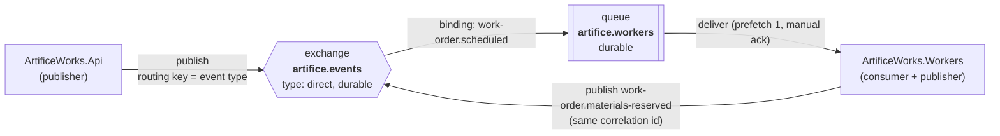
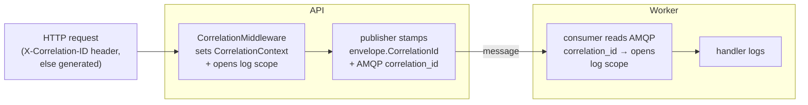

# Messaging topology

How ArtificeWorks moves events from the API to the workers over RabbitMQ, and how a
single correlation id threads one work order's story through both services' logs.

This document is the source of truth for the broker layout. You should be able to draw the
exchanges, queues, and bindings from it without reading code.

## At a glance

Since Epic 5 the worker is **both** a consumer and a publisher: picking materials for a
scheduled order emits `work-order.materials-reserved` back onto the same exchange, which is
how the pipeline continues to the next stage. Nothing binds that routing key yet — Epic 6's
production consumer is its first subscriber.

## Exchange

| Property | Value |
| --- | --- |
| Name | `artifice.events` |
| Type | `direct` |
| Durable | yes |
| Auto-delete | no |

There is **one** exchange for the whole system. Every event is published to it with the
**event type as the routing key** (e.g. `work-order.scheduled`). A direct exchange routes a
message only to queues bound with a routing key equal to the message's — so a queue opts in
to exactly the event types it names, and nothing else.

Why direct (not topic or fanout): routing keys here are exact, flat event-type strings with
no wildcard subscriptions, and not every consumer should see every event. Direct is the
simplest exchange that gives per-event-type subscription. If a future consumer needs
pattern subscriptions (`work-order.*`), that's the point to revisit topic.

The exchange is declared by the shared connection on first use
([`RabbitMqConnection`](../src/ArtificeWorks.Infrastructure/Messaging/RabbitMqConnection.cs)),
so whichever service starts first declares it; the declaration is idempotent.

## Queues and bindings

| Queue | Durable | Bound routing keys | Consumer |
| --- | --- | --- | --- |
| `artifice.workers` | yes | one per handled event type — currently `work-order.scheduled` | `ArtificeWorks.Workers` |

The worker owns a single durable queue. On startup it declares the queue and then binds it
to `artifice.events` **once per handled event type** — the set of bindings is derived from
the registered handlers, not hard-coded. Registering a new handler
(`AddEventHandler<TEvent, THandler>()`) adds its event type to that set, so the binding
appears automatically with no change to the consumer loop.

Only bound routing keys reach the queue. An event type with no handler is never delivered
(the direct exchange drops it for this queue), which is why the queue's bindings and the
worker's handler set are always the same list.

### Delivery and acknowledgement

- **Prefetch 1** — the worker holds at most one unacknowledged message at a time. Simple and
  fair for the current single-consumer slice.
- **Manual acks** — a message is acked only after its handler succeeds.
- **Nack without requeue on failure** — if a handler throws, the message is nacked with
  `requeue: false` and dropped. There is no dead-letter queue yet, so requeuing a poison
  message would loop forever. Epic 8 (reliability) adds a DLQ and revisits this policy.

### What counts as a failure

Only genuine faults nack. **Business outcomes ack**, because they were handled:

| Outcome of picking a scheduled order | Message |
| --- | --- |
| Materials reserved | ack |
| Insufficient stock → order placed OnHold with a reason | **ack** — a factory waiting on parts is a result, not an error |
| Duplicate delivery → already picked, nothing done | **ack** — by definition already handled |
| Unexpected exception (broker/database fault, bug) | nack, `requeue: false` |

Keeping that line sharp is what stops normal business flow from polluting Epic 8's retry and
dead-letter design.

### Idempotent consumption

At-most-once *publish* still meets at-least-once *delivery*: redeliveries happen on consumer
restarts and network hiccups. Picking is made safe against them by making the pick record
itself the dedupe key — a **unique index on `material_reservations.work_order_id`** means a
second delivery's insert fails and its inventory decrements roll back with it. The dedupe
marker and the reservation are the same row, so they commit atomically by construction. The
skip is logged (never silently swallowed) so Epic 12 can demo a redelivery live.

## Message shape

Each message body is a JSON [`EventEnvelope<T>`](../src/ArtificeWorks.Application/Messaging/EventEnvelope.cs)
(camelCase, web defaults) wrapping the typed event payload. Alongside the body, these AMQP
basic properties are set by the publisher so a consumer or the management UI can triage
without deserializing:

| AMQP property | Value | Source |
| --- | --- | --- |
| `type` | event type (also the routing key) | `envelope.EventType` |
| `message_id` | unique id for this message | `envelope.EventId` |
| `correlation_id` | ties the message to one logical operation | `envelope.CorrelationId` |
| `content_type` | `application/json` | fixed |
| `delivery_mode` | persistent (2) | fixed — survives a broker restart on a durable queue |
| `timestamp` | publish time (unix seconds) | publisher clock |

## Correlation

A correlation id is the thread that ties one work order's whole story together across both
services. It flows in one direction, established once at the edge:

1. **Established at the API boundary.** `CorrelationMiddleware` honours an inbound
   `X-Correlation-ID` request header when it's a valid Guid, otherwise uses the fresh id the
   per-request `CorrelationContext` defaults to. The id is echoed back on the response's
   `X-Correlation-ID` header.
2. **Carried on the event.** The publisher stamps that id onto both `envelope.CorrelationId`
   and the AMQP `correlation_id` property of every event raised during the request.
3. **Resumed in the worker.** On each delivery the consumer reads the AMQP `correlation_id`
   and opens a logging scope with it — no need to deserialize the body first.
4. **In the logs on both sides.** Both services push the id into a logging scope under the
   same key (`CorrelationId`, see
   [`CorrelationLog`](../src/ArtificeWorks.Application/Messaging/CorrelationLog.cs)) with
   console scopes enabled, so **one `grep` of a correlation id returns every log line — API
   and worker — for that operation.**

5. **Carried forward on re-publish.** Since Epic 5 the worker publishes as well as consumes.
   Its handler adopts the inbound `envelope.CorrelationId` into the per-message
   `CorrelationContext` before running the workflow, so `work-order.materials-reserved`
   goes out under the id the original HTTP request started with. The thread now spans
   API → scheduling event → picking → materials event, and one `grep` still returns all of it.

## Related code

- Exchange + connection: [`RabbitMqConnection`](../src/ArtificeWorks.Infrastructure/Messaging/RabbitMqConnection.cs), [`RabbitMqConfiguration`](../src/ArtificeWorks.Infrastructure/Messaging/RabbitMqConfiguration.cs)
- Publisher: [`RabbitMqEventPublisher`](../src/ArtificeWorks.Infrastructure/Messaging/RabbitMqEventPublisher.cs)
- Consumer + queue/bindings: [`RabbitMqConsumerService`](../src/ArtificeWorks.Workers/Consuming/RabbitMqConsumerService.cs), [`EventDispatcher`](../src/ArtificeWorks.Workers/Consuming/EventDispatcher.cs)
- Correlation: [`CorrelationMiddleware`](../src/ArtificeWorks.Api/Middleware/CorrelationMiddleware.cs), [`CorrelationContext`](../src/ArtificeWorks.Application/Messaging/CorrelationContext.cs), [`CorrelationLog`](../src/ArtificeWorks.Application/Messaging/CorrelationLog.cs)
